# EkkoJS Architecture

## Overview

EkkoJS is a modern JavaScript runtime built on .NET 9 and V8, designed with a 100% ES module-only approach. All code execution happens through ClearScript's native ES module support with the document loader pattern.

## Architecture Diagram


## Key Architectural Decisions

### 1. 100% ES Module System
- **ALL** code is executed as ES modules (`ModuleCategory.Standard`)
- No CommonJS support, no script mode
- ClearScript's document loader handles all module loading
- Static imports only (dynamic import not currently supported)

### 2. Protocol-Based Module System
- `ekko:` - Built-in modules (fs, path)
- `package:` - Compiled package assemblies
- `dotnet:` - .NET assembly integration
- `native:` - Native library integration
- `ipc:` - Inter-process communication

### 3. Package Compilation
- JavaScript/TypeScript packages compile to .NET assemblies
- Embedded virtual file system using Base64 encoding
- Self-contained distribution model
- Support for assembly signing (strong name & Authenticode)

### 4. Language Support
- JavaScript: Direct execution as ES modules
- TypeScript: Compiled to ESNext modules, then executed
- All files treated as modules regardless of extension

### 5. Integration Layers
- **.NET Integration**: Dynamic assembly loading with JSON mapping
- **Native Integration**: Dynamic P/Invoke with JSON mapping
- **IPC Integration**: Multi-transport (Named Pipes, TCP, Unix Sockets)

### 6. Core Components

#### EkkoRuntime
- Main orchestrator for the JavaScript runtime
- Initializes V8 engine with ClearScript
- Manages event loop and timers
- Configures document loader for ES modules

#### ModuleDocumentLoader
- ClearScript DocumentLoader implementation
- Handles all protocol-based imports
- Returns all content as ES modules
- Loads from:
  - File system
  - Package assemblies (embedded resources)
  - Built-in modules

#### PackageCompiler
- Uses Roslyn for dynamic compilation
- Generates C# code implementing IEkkoPackage
- Embeds JavaScript files as Base64 resources
- Creates self-contained .NET assemblies

## Data Flow


## Module Resolution Flow (Target Architecture)


### Correct Architecture - How Protocols Should Work


### Protocol Implementation Details


## Package Build Process


## Package Assembly Structure

### Package as .NET Assembly Architecture


### Package Loading and File Access Flow

```mermaid
flowchart TB
    subgraph "Package Source Structure"
        PkgFolder["📁 demo-package/"]
        EkkoFolder["📁 .ekko/"]
        EkkoJson["📄 ekko.json"]
        SrcFolder["📁 src/"]
        IndexJS["📄 index.js"]
        OtherFiles["📄 other files..."]
        
        PkgFolder --> EkkoFolder
        EkkoFolder --> EkkoJson
        PkgFolder --> SrcFolder
        SrcFolder --> IndexJS
        SrcFolder --> OtherFiles
    end

    subgraph "Compilation Process"
        Compiler["PackageCompiler"]
        FileDict["Dictionary<string, string><br/>path → Base64 content"]
        CodeGen["C# Code Generation"]
        
        EkkoJson --> |"Read manifest"| Compiler
        SrcFolder --> |"Scan all files"| Compiler
        Compiler --> |"Base64 encode"| FileDict
        FileDict --> CodeGen
    end

    subgraph "Generated C# Code Structure"
        GenClass["public class Package : IEkkoPackage"]
        StaticFiles["static Dictionary<string, string> _files = new()<br/>{<br/>  ['src/index.js'] = 'base64...',<br/>  ['src/utils.js'] = 'base64...'<br/>}"]
        GetFS["public IPackageFileSystem GetFileSystem()<br/>{<br/>  return new VirtualFileSystem(_files);<br/>}"]
        
        CodeGen --> GenClass
        GenClass --> StaticFiles
        GenClass --> GetFS
    end

    subgraph "Runtime File Access"
        Import["import from 'package:@demo/hello'"]
        DocLoader["ModuleDocumentLoader"]
        LoadAsm["Assembly.LoadFrom('demo.hello.dll')"]
        CreateInst["Activator.CreateInstance(packageType)"]
        GetMain["package.GetFileSystem().ReadFile(manifest.Main)"]
        ReturnJS["Return JavaScript text"]
        
        Import --> DocLoader
        DocLoader --> LoadAsm
        LoadAsm --> CreateInst
        CreateInst --> GetMain
        GetMain --> ReturnJS
    end
```




### Detailed File Access API


### Virtual File System Implementation

```mermaid
classDiagram
    class VirtualFileSystem {
        -Dictionary~string,string~ _files
        --
        +VirtualFileSystem(Dictionary files)
        +bool FileExists(string path)
        +string ReadFile(string path)
        +byte[] ReadFileBytes(string path)
        +string[] GetFiles(string pattern)
        +Dictionary~string,string~ GetAllFiles()
        --
        -string NormalizePath(string path)
        -bool MatchesPattern(string path, string pattern)
    }

    class FileOperations {
        <<usage examples>>
        FileExists("src/index.js") → true
        ReadFile("src/index.js") → "export function..."
        ReadFileBytes("assets/icon.png") → byte[]
        GetFiles("src/*.js") → ["src/index.js", "src/utils.js"]
        GetAllFiles() → complete file dictionary
    }

    VirtualFileSystem --> FileOperations : provides
```




### Example Generated Package Class

```csharp
// Auto-generated by PackageCompiler
using EkkoJS.Core.Packages;
using System.Collections.Generic;

namespace demo.hello_world
{
    public class Package : IEkkoPackage
    {
        private static readonly Dictionary<string, string> _files = new Dictionary<string, string>
        {
            ["src/index.js"] = "Ly8gRGVtbyBwYWNrYWdlIG1haW4gZW50cnkgcG9pbnQKZXhwb3J0IGZ1bmN0aW9uIGdyZWV0KG5hbWUgPSAnV29ybGQnKSB7CiAgICByZXR1cm4gYEhlbGxvLCAke25hbWV9IWA7Cn0KCmV4cG9ydCBmdW5jdGlvbiBhZGQoYSwgYikgewogICAgcmV0dXJuIGEgKyBiOwp9CgpleHBvcnQgY29uc3QgdmVyc2lvbiA9ICcxLjAuMCc7CgpleHBvcnQgZGVmYXVsdCB7CiAgICBncmVldCwKICAgIGFkZCwKICAgIHZlcnNpb24KfTs=",
            ["src/utils.js"] = "ZXhwb3J0IGZ1bmN0aW9uIHV0aWxpdHlGdW5jdGlvbigpIHsgLyogLi4uICovIH0=",
            ["assets/data.json"] = "eyJrZXkiOiAidmFsdWUifQ==",
            // ... more files
        };

        private readonly PackageManifest _manifest = new PackageManifest
        {
            Name = "@demo/hello-world",
            Version = "1.0.0",
            Description = "A simple demo package",
            Main = "src/index.js",
            // ... other manifest properties
        };

        public string Name => _manifest.Name;
        public string Version => _manifest.Version;

        public PackageManifest GetManifest() => _manifest;

        public IPackageFileSystem GetFileSystem()
        {
            return new VirtualFileSystem(_files);
        }
    }
}
```

## Implementation Plan for Protocol Integration

### Current State vs Target State

| Protocol | Current Implementation | Target Implementation |
|----------|----------------------|---------------------|
| `ekko:` | ✅ In DocumentLoader | ✅ Already complete |
| `package:` | ✅ In DocumentLoader | ✅ Already complete |
| `file path` | ✅ In DocumentLoader | ✅ Already complete |
| `dotnet:` | ✅ In DocumentLoader | ✅ Complete - Generates ES module JS |
| `native:` | ✅ In DocumentLoader | ✅ Complete - Generates ES module JS |
| `ipc:` | ✅ In DocumentLoader | ✅ Complete - Generates ES module JS |

### Implementation Tasks

#### 1. Implement GetDotNetModule() in ModuleDocumentLoader

```csharp
private string GetDotNetModule(string moduleSpec)
{
    // Parse: "dotnet:AssemblyName" or "dotnet:AssemblyName/TypeName"
    // Use DotNetAssemblyLoader to load assembly and get type
    // Generate JavaScript code that:
    //   1. Creates a host object reference
    //   2. Wraps it with proper ES module exports
    //   3. Handles static methods, properties, constructors
    
    return @"
        const hostType = globalThis.__dotnetTypes['AssemblyName.TypeName'];
        export default hostType;
        // Export individual static methods/properties as named exports
    ";
}
```

#### 2. Implement GetNativeModule() in ModuleDocumentLoader

```csharp
private string GetNativeModule(string libraryName)
{
    // Use NativeLibraryLoader to load the library
    // Read the JSON mapping file
    // Generate JavaScript code that:
    //   1. Creates function wrappers for each native function
    //   2. Handles parameter marshaling
    //   3. Exports as ES module
    
    return @"
        const lib = globalThis.__nativeLibs['libraryName'];
        export function add(a, b) { return lib.add(a, b); }
        export function multiply(a, b) { return lib.multiply(a, b); }
        // ... more exports
    ";
}
```

#### 3. Implement GetIpcModule() in ModuleDocumentLoader

```csharp
private string GetIpcModule(string serviceName)
{
    // Read IPC service mapping
    // Generate JavaScript code that:
    //   1. Creates IPC client instance
    //   2. Wraps methods for RPC calls
    //   3. Sets up event subscriptions
    //   4. Exports as ES module
    
    return @"
        const client = globalThis.__ipcClients['serviceName'];
        export function call(method, ...args) { return client.call(method, args); }
        export function subscribe(event, handler) { return client.subscribe(event, handler); }
        export function publish(channel, data) { return client.publish(channel, data); }
        export default { call, subscribe, publish };
    ";
}
```

### Migration Complete

All protocols have been successfully migrated to the Document Loader pattern:
- ✅ All protocols now generate ES module JavaScript
- ✅ ESModuleLoader has been removed
- ✅ All module loading goes through ModuleDocumentLoader
- ✅ Everything is treated as ES modules (ModuleCategory.Standard)

## Notes

1. All protocols will be handled through the Document Loader
2. Dynamic import() is not currently supported due to ClearScript limitations with custom protocols
3. The system generates ES module JavaScript code for all protocols
4. All imports are executed as ES modules (ModuleCategory.Standard)
5. Package files are stored as Base64-encoded strings in compiled assemblies
6. The virtual file system provides a file-like API for accessing embedded resources
7. Package assemblies are completely self-contained with no external dependencies