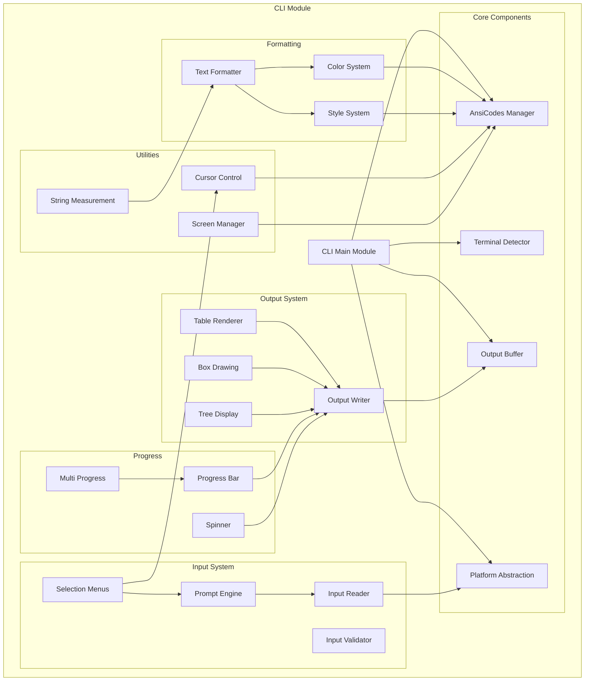
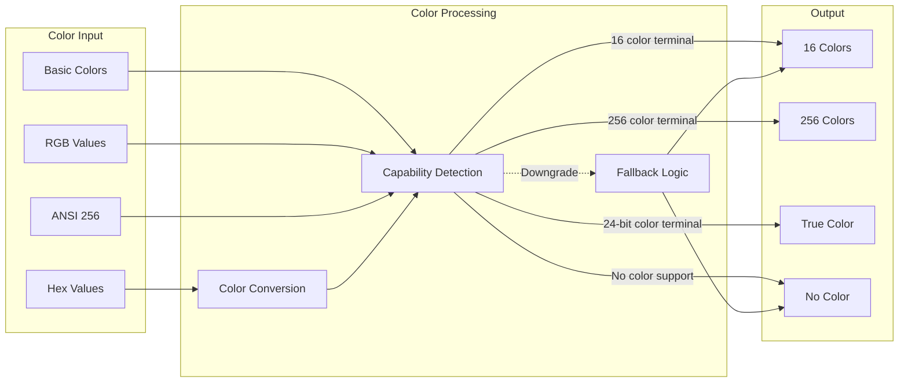
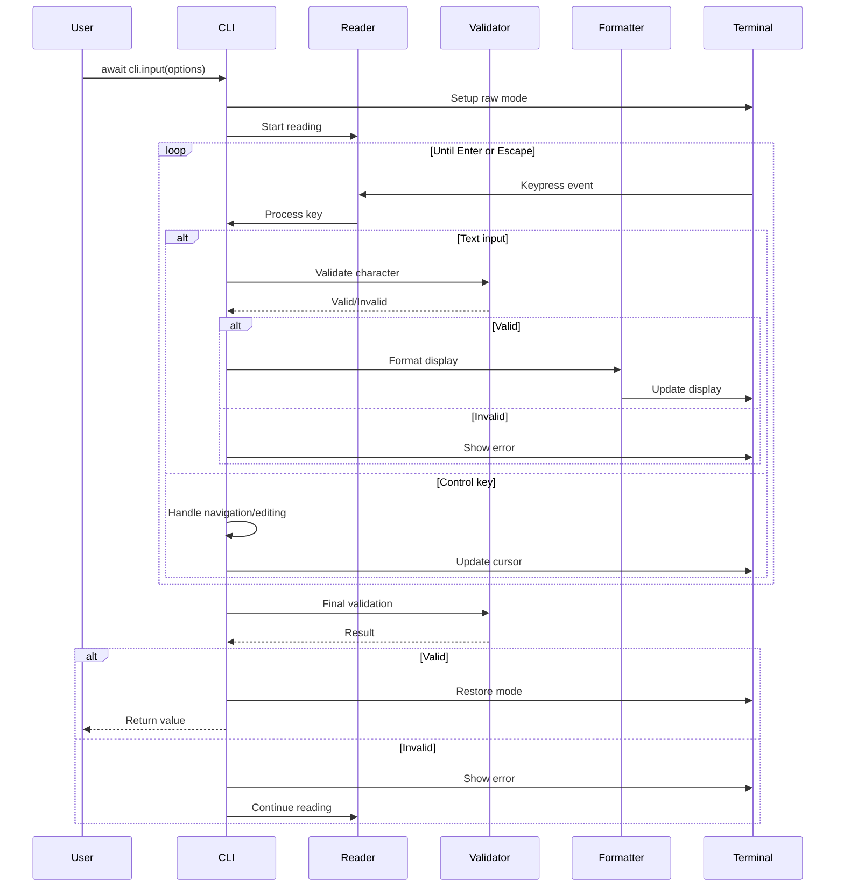
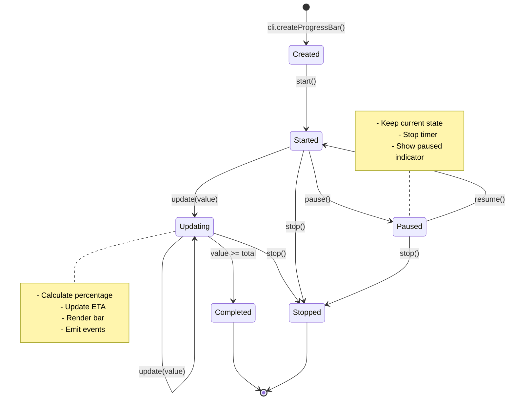
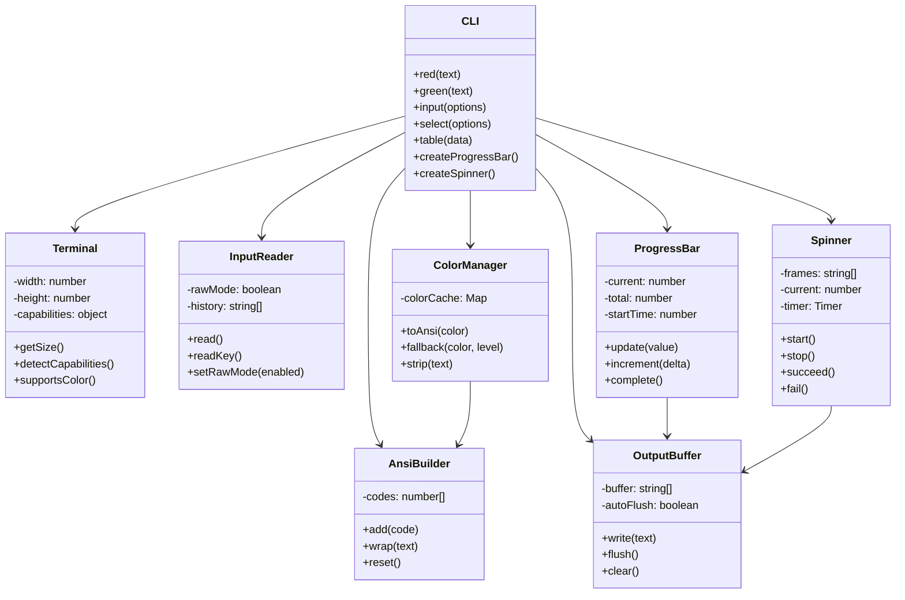
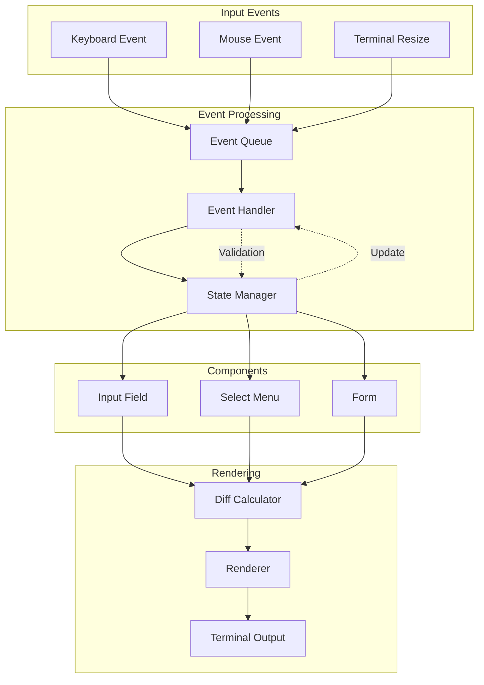
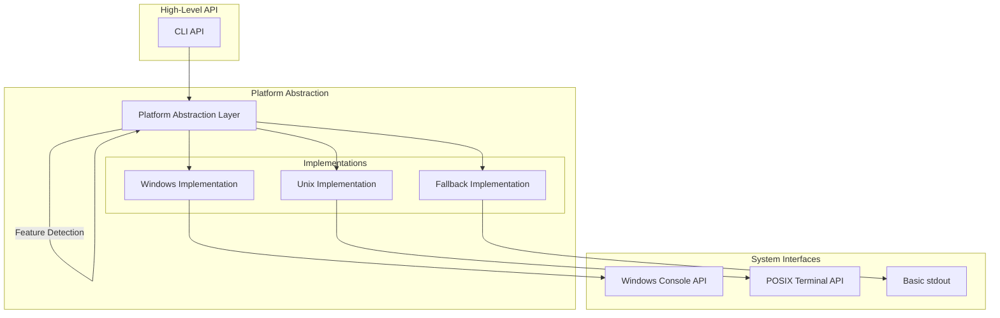

# CLI Module Design Document

## Overview

The `ekko:cli` module provides a comprehensive set of tools for building command-line interfaces in EkkoJS. It focuses on simplicity, cross-platform compatibility, and a fluent API design.

## Core Architecture

### Module Structure

```
ekko:cli
├── Core
│   ├── AnsiCodes          # ANSI escape sequence management
│   ├── Terminal           # Terminal capabilities detection
│   ├── Buffer             # Output buffering
│   └── Platform           # Platform-specific implementations
├── Formatting
│   ├── Colors             # Color management
│   ├── Styles             # Text styling
│   └── Formatter          # Text formatting engine
├── Input
│   ├── Reader             # Low-level input reader
│   ├── Prompt             # Basic prompts
│   ├── Select             # Selection menus
│   └── Validator          # Input validation
├── Output
│   ├── Writer             # Output writer
│   ├── Table              # Table renderer
│   ├── Box                # Box drawing
│   └── Tree               # Tree structure display
├── Progress
│   ├── ProgressBar        # Progress indicators
│   ├── Spinner            # Loading spinners
│   └── MultiProgress      # Multiple progress bars
└── Utils
    ├── Cursor             # Cursor control
    ├── Screen             # Screen management
    └── Measurement        # String width calculation
```

## API Design

### 1. Color and Style System

#### Color Management

```javascript
// Basic colors
cli.red('Error message');
cli.green('Success!');
cli.yellow('Warning');
cli.blue('Info');
cli.magenta('Special');
cli.cyan('Debug');
cli.white('Normal');
cli.gray('Muted');
cli.black('Black text');

// Bright variants
cli.brightRed('Bright red');
cli.brightGreen('Bright green');
// ... etc

// 256 color support
cli.color(196)('Custom red'); // 0-255
cli.bgColor(21)('Blue background');

// RGB support (true color)
cli.rgb(255, 128, 0)('Orange text');
cli.bgRgb(0, 0, 128)('Dark blue background');

// Hex color support
cli.hex('#FF8800')('Orange from hex');
cli.bgHex('#000080')('Navy background');
```

#### Style Attributes

```javascript
// Basic styles
cli.bold('Bold text');
cli.italic('Italic text');
cli.underline('Underlined');
cli.strikethrough('Crossed out');
cli.inverse('Inverted colors');
cli.dim('Dimmed text');
cli.hidden('Hidden text');

// Style combinations (chainable)
cli.bold.red('Bold red text');
cli.underline.blue('Underlined blue');
cli.italic.yellow.bgBlue('Complex styling');

// Reset styles
cli.reset('Reset all styles');
```

#### Advanced Formatting

```javascript
// Template literal support
cli.template`
  Status: ${cli.green('Active')}
  Errors: ${cli.red(errorCount)}
  Time: ${cli.cyan(new Date().toISOString())}
`;

// Conditional styling
cli.style({
  color: errorCount > 0 ? 'red' : 'green',
  bold: errorCount > 5,
  background: isUrgent ? 'yellow' : null
})(`Errors: ${errorCount}`);

// Style stripping
const styledText = cli.red('Hello');
const plainText = cli.stripAnsi(styledText); // "Hello"
```

### 2. Screen and Cursor Control

#### Screen Management

```javascript
// Clear operations
cli.clear();              // Clear entire screen and move cursor to 0,0
cli.clearScreen();        // Clear screen but keep cursor position
cli.clearLine();          // Clear current line
cli.clearLineLeft();      // Clear from cursor to start of line
cli.clearLineRight();     // Clear from cursor to end of line
cli.clearDown();          // Clear from cursor to bottom of screen
cli.clearUp();            // Clear from cursor to top of screen

// Screen queries
const { width, height } = cli.getScreenSize();
const { x, y } = cli.getCursorPosition(); // Async operation

// Scrolling
cli.scrollUp(5);          // Scroll up 5 lines
cli.scrollDown(3);        // Scroll down 3 lines

// Alternative screen buffer (for full-screen apps)
cli.enterAlternateScreen();
// ... your app
cli.exitAlternateScreen();
```

#### Cursor Control

```javascript
// Absolute positioning
cli.cursorTo(10, 5);      // Move to column 10, row 5
cli.cursorToColumn(20);   // Move to column 20 in current row

// Relative movement
cli.cursorUp(3);          // Move up 3 lines
cli.cursorDown(2);        // Move down 2 lines
cli.cursorForward(5);     // Move right 5 columns
cli.cursorBackward(5);    // Move left 5 columns

// Line movement
cli.cursorNextLine(2);    // Move to beginning of 2nd line down
cli.cursorPrevLine(1);    // Move to beginning of previous line

// Save/restore position
cli.saveCursor();         // Save current position
// ... move around
cli.restoreCursor();      // Return to saved position

// Visibility
cli.hideCursor();         // Hide cursor
cli.showCursor();         // Show cursor

// Cursor styles (if supported)
cli.setCursorStyle('block');    // ▉
cli.setCursorStyle('underline'); // _
cli.setCursorStyle('bar');       // |
```

### 3. Input System

#### Basic Input

```javascript
// Simple text input
const name = await cli.input('Enter your name: ');
const age = await cli.input({
  message: 'Enter your age: ',
  validate: (value) => {
    const num = parseInt(value);
    if (isNaN(num) || num < 0) {
      return 'Please enter a valid age';
    }
    return true;
  },
  transform: (value) => parseInt(value)
});

// Password input (hidden)
const password = await cli.password('Enter password: ');
const confirmPassword = await cli.password({
  message: 'Confirm password: ',
  mask: '*',  // Custom mask character (default: no echo)
  validate: (value) => {
    if (value !== password) {
      return 'Passwords do not match';
    }
    return true;
  }
});

// Yes/no confirmation
const proceed = await cli.confirm('Continue? ');
const deleteConfirm = await cli.confirm({
  message: 'Delete this file?',
  default: false,
  format: (value) => value ? 'Yes' : 'No'
});
```

#### Selection Menus

```javascript
// Single select
const choice = await cli.select({
  message: 'Choose your favorite color:',
  choices: ['Red', 'Green', 'Blue', 'Yellow'],
  default: 'Blue'
});

// With custom values
const framework = await cli.select({
  message: 'Select a framework:',
  choices: [
    { label: 'React', value: 'react', hint: 'A JavaScript library' },
    { label: 'Vue', value: 'vue', hint: 'Progressive framework' },
    { label: 'Angular', value: 'angular', hint: 'Platform for web apps' },
    { separator: true },
    { label: 'None', value: null }
  ],
  hint: 'Use arrow keys to navigate',
  pageSize: 10  // Show 10 items at a time
});

// Multi-select
const features = await cli.multiSelect({
  message: 'Select features to install:',
  choices: [
    { label: 'TypeScript', value: 'ts', checked: true },
    { label: 'ESLint', value: 'eslint', checked: true },
    { label: 'Prettier', value: 'prettier' },
    { label: 'Testing', value: 'test' },
    { label: 'Git hooks', value: 'git-hooks' }
  ],
  min: 1,  // Minimum selections
  max: 3,  // Maximum selections
  validate: (selected) => {
    if (selected.includes('test') && !selected.includes('ts')) {
      return 'Testing requires TypeScript';
    }
    return true;
  }
});

// Autocomplete
const file = await cli.autocomplete({
  message: 'Select a file:',
  source: async (input) => {
    // Return filtered suggestions based on input
    const files = await fs.readdir('.');
    return files
      .filter(f => f.includes(input))
      .map(f => ({ label: f, value: f }));
  },
  suggestOnly: false  // If true, allows custom input
});
```

#### Advanced Input

```javascript
// Number input
const port = await cli.number({
  message: 'Port number:',
  default: 3000,
  min: 1024,
  max: 65535,
  step: 1
});

// Date input
const date = await cli.date({
  message: 'Select a date:',
  default: new Date(),
  min: new Date('2024-01-01'),
  max: new Date('2024-12-31'),
  format: 'YYYY-MM-DD'
});

// Editor (opens system editor)
const content = await cli.editor({
  message: 'Edit the configuration:',
  default: 'Initial content...',
  extension: '.json',
  editor: process.env.EDITOR || 'vim'
});

// Form (multiple inputs)
const answers = await cli.form({
  message: 'User Registration',
  fields: [
    {
      name: 'username',
      message: 'Username:',
      type: 'input',
      validate: (v) => v.length >= 3 || 'Min 3 characters'
    },
    {
      name: 'email',
      message: 'Email:',
      type: 'input',
      validate: (v) => /\S+@\S+\.\S+/.test(v) || 'Invalid email'
    },
    {
      name: 'password',
      message: 'Password:',
      type: 'password',
      validate: (v) => v.length >= 8 || 'Min 8 characters'
    },
    {
      name: 'newsletter',
      message: 'Subscribe to newsletter?',
      type: 'confirm',
      default: true
    }
  ]
});
```

### 4. Progress Indicators

#### Progress Bar

```javascript
// Basic progress bar
const progress = cli.createProgressBar({
  total: 100,
  width: 40,
  complete: '=',
  incomplete: '-',
  head: '>',
  format: '{bar} {percent}% | ETA: {eta}s | {value}/{total}'
});

// Update progress
for (let i = 0; i <= 100; i++) {
  progress.update(i, {
    customToken: 'Processing...'
  });
  await sleep(50);
}
progress.complete();

// Multi-bar progress
const multibar = cli.createMultiProgress({
  clearOnComplete: false,
  hideCursor: true
});

const bar1 = multibar.add(100, { label: 'Download 1' });
const bar2 = multibar.add(200, { label: 'Download 2' });

// Update independently
bar1.update(50);
bar2.update(100);

// Custom format function
const customProgress = cli.createProgressBar({
  total: files.length,
  format: (progress, options) => {
    const bar = cli.progressBar(progress.percent, options.width);
    return `${options.label} ${bar} ${progress.value}/${progress.total} files`;
  }
});
```

#### Spinners

```javascript
// Basic spinner
const spinner = cli.createSpinner('Loading...');
spinner.start();

// Update text
spinner.text = 'Still loading...';
spinner.color = 'yellow';

// Complete with different states
spinner.succeed('Done!');          // ✓ Done!
spinner.fail('Error occurred');    // ✗ Error occurred
spinner.warn('Completed with warnings'); // ⚠ Completed with warnings
spinner.info('Information');       // ℹ Information
spinner.stop();                    // Just stop, no symbol

// Custom spinner
const customSpinner = cli.createSpinner({
  text: 'Processing',
  spinner: {
    frames: ['⠋', '⠙', '⠹', '⠸', '⠼', '⠴', '⠦', '⠧', '⠇', '⠏'],
    interval: 80
  },
  color: 'cyan',
  prefixText: '[TASK] ',
  suffixText: ' (this may take a while)'
});

// Available spinners
const spinners = cli.spinners; // List of built-in spinners
// dots, dots2, dots3, line, line2, pipe, star, hamburger, 
// growVertical, growHorizontal, balloon, clock, etc.
```

### 5. Output Formatting

#### Tables

```javascript
// Simple table
cli.table([
  ['Name', 'Age', 'City'],
  ['John Doe', '30', 'New York'],
  ['Jane Smith', '25', 'London'],
  ['Bob Johnson', '35', 'Paris']
]);

// Advanced table
cli.table({
  head: ['ID', 'Name', 'Status', 'Progress'],
  rows: [
    ['001', 'Task 1', cli.green('Complete'), '100%'],
    ['002', 'Task 2', cli.yellow('In Progress'), '60%'],
    ['003', 'Task 3', cli.red('Failed'), '0%']
  ],
  style: {
    head: { color: 'cyan', bold: true },
    border: { color: 'gray' },
    compact: false,
    borderStyle: 'single' // single, double, round, bold, ascii
  },
  colWidths: [5, 20, 15, 10],
  colAligns: ['left', 'left', 'center', 'right'],
  wordWrap: true
});

// Column configuration
cli.table({
  columns: [
    { key: 'id', label: 'ID', width: 5 },
    { key: 'name', label: 'Name', width: 20, truncate: true },
    { key: 'status', label: 'Status', align: 'center' },
    { 
      key: 'progress', 
      label: 'Progress', 
      align: 'right',
      format: (value) => `${value}%`
    }
  ],
  data: [
    { id: 1, name: 'Long task name that will be truncated', status: 'Active', progress: 75 },
    { id: 2, name: 'Short task', status: 'Done', progress: 100 }
  ]
});
```

#### Box Drawing

```javascript
// Simple box
cli.box('Hello, World!');

// Configured box
cli.box({
  content: 'Important Message',
  padding: 2,
  margin: 1,
  borderStyle: 'double',
  borderColor: 'yellow',
  backgroundColor: 'blue',
  align: 'center',
  width: 50,
  title: 'Notice',
  titleAlign: 'center'
});

// Multiple boxes
cli.box([
  { content: 'Box 1', borderColor: 'red' },
  { content: 'Box 2', borderColor: 'green' },
  { content: 'Box 3', borderColor: 'blue' }
], { 
  layout: 'horizontal',
  spacing: 2 
});

// Border styles
// single: ┌─┐│└┘
// double: ╔═╗║╚╝
// round:  ╭─╮│╰╯
// bold:   ┏━┓┃┗┛
// ascii:  +-+|+-+
// none:   (no border)
```

#### Tree Display

```javascript
// Simple tree
cli.tree({
  label: 'root',
  children: [
    {
      label: 'folder1',
      children: [
        { label: 'file1.js' },
        { label: 'file2.js' }
      ]
    },
    {
      label: 'folder2',
      children: [
        { label: 'file3.js' }
      ]
    }
  ]
});

// Styled tree
cli.tree({
  label: cli.bold('project'),
  children: [
    {
      label: cli.blue('src'),
      expanded: true,
      children: [
        { label: 'index.js', icon: '📄' },
        { label: 'utils.js', icon: '📄' },
        {
          label: cli.blue('components'),
          children: [
            { label: 'Button.jsx', icon: '⚛️' },
            { label: 'Input.jsx', icon: '⚛️' }
          ]
        }
      ]
    },
    {
      label: cli.green('tests'),
      expanded: false,
      children: [
        { label: 'test.spec.js', icon: '🧪' }
      ]
    }
  ]
}, {
  style: {
    tree: '│├└',     // Characters for tree branches
    expandedIcon: '▼',
    collapsedIcon: '▶',
    leafIcon: '•'
  }
});
```

### 6. Utilities

#### String Measurement

```javascript
// Account for ANSI codes and wide characters
const width = cli.stringWidth('Hello 世界'); // 10 (Hello=5 + space=1 + 世界=4)
const widthStyled = cli.stringWidth(cli.red('Hello')); // 5 (ignores ANSI)

// Truncate with ellipsis
const truncated = cli.truncate('Very long string', 10); // "Very lo..."
const truncatedMiddle = cli.truncate('Very long string', 10, { position: 'middle' }); // "Very...ing"

// Wrap text
const wrapped = cli.wrap('Long text that needs wrapping', 20);
const wrappedWithIndent = cli.wrap(text, 20, { indent: 2, trim: true });

// Pad text
const padded = cli.pad('Hello', 10); // "  Hello   "
const leftPad = cli.padLeft('Hello', 10); // "     Hello"
const rightPad = cli.padRight('Hello', 10); // "Hello     "

// Align text
const centered = cli.center('Title', 80); // Centers in 80 columns
const right = cli.right('Page 1', 80); // Right aligns in 80 columns
```

#### Terminal Detection

```javascript
// Capabilities detection
const capabilities = cli.getCapabilities();
/*
{
  colors: 16777216,      // Number of colors (16, 256, 16m)
  unicode: true,         // Unicode support
  interactive: true,     // Is interactive terminal
  width: 120,           // Terminal width
  height: 40,           // Terminal height
  isWindows: false,     // Platform detection
  isMac: false,
  isLinux: true,
  program: 'xterm-256color', // Terminal program
  mouse: true,          // Mouse support
  hyperlinks: true      // Hyperlink support
}
*/

// Conditional features
if (cli.supportsColor()) {
  console.log(cli.red('Error in red'));
} else {
  console.log('Error');
}

if (cli.supportsUnicode()) {
  console.log('✓ Success');
} else {
  console.log('[OK] Success');
}

// Force color output
cli.forceColor();     // Force color output
cli.forceNoColor();   // Disable colors
```

#### Links and Special Output

```javascript
// Hyperlinks (if supported)
cli.link('Click here', 'https://example.com');

// File links
cli.fileLink('error.log', '/path/to/error.log');

// Beep
cli.beep(); // System beep

// Images (if terminal supports)
cli.image('/path/to/image.png', {
  width: 40,
  height: 20,
  preserveAspectRatio: true
});
```

## Implementation Details

### Platform Abstraction

```javascript
// Internal platform detection
class Platform {
  static isWindows = process.platform === 'win32';
  static isMac = process.platform === 'darwin';
  static isLinux = process.platform === 'linux';
  
  static getTerminalProgram() {
    return process.env.TERM_PROGRAM || 
           process.env.TERM || 
           'unknown';
  }
  
  static supportsAnsi() {
    // Complex detection logic
  }
}
```

### ANSI Code Management

```javascript
// Internal ANSI builder
class AnsiBuilder {
  constructor() {
    this.codes = [];
  }
  
  add(code) {
    this.codes.push(code);
    return this;
  }
  
  wrap(text) {
    if (this.codes.length === 0) return text;
    return `\x1b[${this.codes.join(';')}m${text}\x1b[0m`;
  }
}
```

### Buffered Output

```javascript
// Output buffering for performance
class OutputBuffer {
  constructor() {
    this.buffer = [];
    this.autoFlush = true;
  }
  
  write(text) {
    this.buffer.push(text);
    if (this.autoFlush && this.buffer.length > 100) {
      this.flush();
    }
  }
  
  flush() {
    if (this.buffer.length > 0) {
      process.stdout.write(this.buffer.join(''));
      this.buffer = [];
    }
  }
}
```

## Error Handling

```javascript
// Graceful degradation
try {
  cli.cursorTo(10, 10);
} catch (error) {
  if (error.code === 'ENOTTY') {
    // Not a terminal, fallback behavior
    console.log('Not running in a terminal');
  }
}

// Validation errors
try {
  const age = await cli.input({
    message: 'Age:',
    validate: (v) => parseInt(v) > 0 || 'Must be positive'
  });
} catch (error) {
  if (error.code === 'VALIDATION_ERROR') {
    console.error('Invalid input:', error.message);
  }
}
```

## Best Practices

1. **Always check capabilities** before using advanced features
2. **Provide fallbacks** for non-interactive environments
3. **Clean up** (restore cursor, clear styles) on exit
4. **Use buffering** for large outputs
5. **Test on multiple terminals** (Windows Terminal, iTerm2, GNOME Terminal, etc.)
6. **Handle Ctrl+C gracefully** to restore terminal state

## Performance Considerations

1. **Minimize redraws** - Update only changed portions
2. **Buffer output** - Reduce system calls
3. **Cache ANSI codes** - Reuse common sequences
4. **Lazy load features** - Don't initialize unused components
5. **Efficient string width** - Cache measurements for repeated strings

## Architecture Diagrams

### Module Structure



![CLI_MODULE_DESIGN Diagram 1](https://mermaid.ink/img/Z3JhcGggVEIKICAgIHN1YmdyYXBoICJDTEkgTW9kdWxlIgogICAgICAgIENMSVtDTEkgTWFpbiBNb2R1bGVdCiAgICAgICAgCiAgICAgICAgc3ViZ3JhcGggIkNvcmUgQ29tcG9uZW50cyIKICAgICAgICAgICAgQU5TSVtBbnNpQ29kZXMgTWFuYWdlcl0KICAgICAgICAgICAgVEVSTVtUZXJtaW5hbCBEZXRlY3Rvcl0KICAgICAgICAgICAgQlVGRltPdXRwdXQgQnVmZmVyXQogICAgICAgICAgICBQTEFUW1BsYXRmb3JtIEFic3RyYWN0aW9uXQogICAgICAgIGVuZAogICAgICAgIAogICAgICAgIHN1YmdyYXBoICJGb3JtYXR0aW5nIgogICAgICAgICAgICBDT0xPUltDb2xvciBTeXN0ZW1dCiAgICAgICAgICAgIFNUWUxFW1N0eWxlIFN5c3RlbV0KICAgICAgICAgICAgRk9STUFUW1RleHQgRm9ybWF0dGVyXQogICAgICAgIGVuZAogICAgICAgIAogICAgICAgIHN1YmdyYXBoICJJbnB1dCBTeXN0ZW0iCiAgICAgICAgICAgIFJFQURFUltJbnB1dCBSZWFkZXJdCiAgICAgICAgICAgIFBST01QVFtQcm9tcHQgRW5naW5lXQogICAgICAgICAgICBTRUxFQ1RbU2VsZWN0aW9uIE1lbnVzXQogICAgICAgICAgICBWQUxJRFtJbnB1dCBWYWxpZGF0b3JdCiAgICAgICAgZW5kCiAgICAgICAgCiAgICAgICAgc3ViZ3JhcGggIk91dHB1dCBTeXN0ZW0iCiAgICAgICAgICAgIFdSSVRFW091dHB1dCBXcml0ZXJdCiAgICAgICAgICAgIFRBQkxFW1RhYmxlIFJlbmRlcmVyXQogICAgICAgICAgICBCT1hbQm94IERyYXdpbmddCiAgICAgICAgICAgIFRSRUVbVHJlZSBEaXNwbGF5XQogICAgICAgIGVuZAogICAgICAgIAogICAgICAgIHN1YmdyYXBoICJQcm9ncmVzcyIKICAgICAgICAgICAgUEJBUltQcm9ncmVzcyBCYXJdCiAgICAgICAgICAgIFNQSU5bU3Bpbm5lcl0KICAgICAgICAgICAgTVVMVElbTXVsdGkgUHJvZ3Jlc3NdCiAgICAgICAgZW5kCiAgICAgICAgCiAgICAgICAgc3ViZ3JhcGggIlV0aWxpdGllcyIKICAgICAgICAgICAgQ1VSU09SW0N1cnNvciBDb250cm9sXQogICAgICAgICAgICBTQ1JFRU5bU2NyZWVuIE1hbmFnZXJdCiAgICAgICAgICAgIE1FQVNVUkVbU3RyaW5nIE1lYXN1cmVtZW50XQogICAgICAgIGVuZAogICAgZW5kCiAgICAKICAgIENMSSAtLT4gQU5TSQogICAgQ0xJIC0tPiBURVJNCiAgICBDTEkgLS0+IEJVRkYKICAgIENMSSAtLT4gUExBVAogICAgCiAgICBDT0xPUiAtLT4gQU5TSQogICAgU1RZTEUgLS0+IEFOU0kKICAgIEZPUk1BVCAtLT4gQ09MT1IKICAgIEZPUk1BVCAtLT4gU1RZTEUKICAgIAogICAgUkVBREVSIC0tPiBQTEFUCiAgICBQUk9NUFQgLS0+IFJFQURFUgogICAgU0VMRUNUIC0tPiBQUk9NUFQKICAgIFNFTEVDVCAtLT4gQ1VSU09SCiAgICAKICAgIFdSSVRFIC0tPiBCVUZGCiAgICBUQUJMRSAtLT4gV1JJVEUKICAgIEJPWCAtLT4gV1JJVEUKICAgIFRSRUUgLS0+IFdSSVRFCiAgICAKICAgIFBCQVIgLS0+IFdSSVRFCiAgICBTUElOIC0tPiBXUklURQogICAgTVVMVEkgLS0+IFBCQVIKICAgIAogICAgQ1VSU09SIC0tPiBBTlNJCiAgICBTQ1JFRU4gLS0+IEFOU0kKICAgIE1FQVNVUkUgLS0+IEZPUk1BVA==)

### Color System Flow



![CLI_MODULE_DESIGN Diagram 2](https://mermaid.ink/img/Zmxvd2NoYXJ0IExSCiAgICBzdWJncmFwaCAiQ29sb3IgSW5wdXQiCiAgICAgICAgQkFTSUNbQmFzaWMgQ29sb3JzXQogICAgICAgIFJHQltSR0IgVmFsdWVzXQogICAgICAgIEhFWFtIZXggVmFsdWVzXQogICAgICAgIEFOU0kyNTZbQU5TSSAyNTZdCiAgICBlbmQKICAgIAogICAgc3ViZ3JhcGggIkNvbG9yIFByb2Nlc3NpbmciCiAgICAgICAgREVURUNUW0NhcGFiaWxpdHkgRGV0ZWN0aW9uXQogICAgICAgIENPTlZFUlRbQ29sb3IgQ29udmVyc2lvbl0KICAgICAgICBGQUxMQkFDS1tGYWxsYmFjayBMb2dpY10KICAgIGVuZAogICAgCiAgICBzdWJncmFwaCAiT3V0cHV0IgogICAgICAgIEFOU0kxNlsxNiBDb2xvcnNdCiAgICAgICAgQU5TSTI1Nk9VVFsyNTYgQ29sb3JzXQogICAgICAgIFRSVUVDT0xPUltUcnVlIENvbG9yXQogICAgICAgIE5PQ09MT1JbTm8gQ29sb3JdCiAgICBlbmQKICAgIAogICAgQkFTSUMgLS0+IERFVEVDVAogICAgUkdCIC0tPiBERVRFQ1QKICAgIEhFWCAtLT4gQ09OVkVSVAogICAgQU5TSTI1NiAtLT4gREVURUNUCiAgICAKICAgIENPTlZFUlQgLS0+IERFVEVDVAogICAgCiAgICBERVRFQ1QgLS0+fCIxNiBjb2xvciB0ZXJtaW5hbCJ8IEFOU0kxNgogICAgREVURUNUIC0tPnwiMjU2IGNvbG9yIHRlcm1pbmFsInwgQU5TSTI1Nk9VVAogICAgREVURUNUIC0tPnwiMjQtYml0IGNvbG9yIHRlcm1pbmFsInwgVFJVRUNPTE9SCiAgICBERVRFQ1QgLS0+fCJObyBjb2xvciBzdXBwb3J0InwgTk9DT0xPUgogICAgCiAgICBERVRFQ1QgLS4tPnwiRG93bmdyYWRlInwgRkFMTEJBQ0sKICAgIEZBTExCQUNLIC0tPiBBTlNJMTYKICAgIEZBTExCQUNLIC0tPiBOT0NPTE9S)

### Input Flow



![CLI_MODULE_DESIGN Diagram 3](https://mermaid.ink/img/c2VxdWVuY2VEaWFncmFtCiAgICBwYXJ0aWNpcGFudCBVc2VyCiAgICBwYXJ0aWNpcGFudCBDTEkKICAgIHBhcnRpY2lwYW50IFJlYWRlcgogICAgcGFydGljaXBhbnQgVmFsaWRhdG9yCiAgICBwYXJ0aWNpcGFudCBGb3JtYXR0ZXIKICAgIHBhcnRpY2lwYW50IFRlcm1pbmFsCiAgICAKICAgIFVzZXItPj5DTEk6IGF3YWl0IGNsaS5pbnB1dChvcHRpb25zKQogICAgQ0xJLT4+VGVybWluYWw6IFNldHVwIHJhdyBtb2RlCiAgICBDTEktPj5SZWFkZXI6IFN0YXJ0IHJlYWRpbmcKICAgIAogICAgbG9vcCBVbnRpbCBFbnRlciBvciBFc2NhcGUKICAgICAgICBUZXJtaW5hbC0+PlJlYWRlcjogS2V5cHJlc3MgZXZlbnQKICAgICAgICBSZWFkZXItPj5DTEk6IFByb2Nlc3Mga2V5CiAgICAgICAgCiAgICAgICAgYWx0IFRleHQgaW5wdXQKICAgICAgICAgICAgQ0xJLT4+VmFsaWRhdG9yOiBWYWxpZGF0ZSBjaGFyYWN0ZXIKICAgICAgICAgICAgVmFsaWRhdG9yLS0+PkNMSTogVmFsaWQvSW52YWxpZAogICAgICAgICAgICAKICAgICAgICAgICAgYWx0IFZhbGlkCiAgICAgICAgICAgICAgICBDTEktPj5Gb3JtYXR0ZXI6IEZvcm1hdCBkaXNwbGF5CiAgICAgICAgICAgICAgICBGb3JtYXR0ZXItPj5UZXJtaW5hbDogVXBkYXRlIGRpc3BsYXkKICAgICAgICAgICAgZWxzZSBJbnZhbGlkCiAgICAgICAgICAgICAgICBDTEktPj5UZXJtaW5hbDogU2hvdyBlcnJvcgogICAgICAgICAgICBlbmQKICAgICAgICBlbHNlIENvbnRyb2wga2V5CiAgICAgICAgICAgIENMSS0+PkNMSTogSGFuZGxlIG5hdmlnYXRpb24vZWRpdGluZwogICAgICAgICAgICBDTEktPj5UZXJtaW5hbDogVXBkYXRlIGN1cnNvcgogICAgICAgIGVuZAogICAgZW5kCiAgICAKICAgIENMSS0+PlZhbGlkYXRvcjogRmluYWwgdmFsaWRhdGlvbgogICAgVmFsaWRhdG9yLS0+PkNMSTogUmVzdWx0CiAgICAKICAgIGFsdCBWYWxpZAogICAgICAgIENMSS0+PlRlcm1pbmFsOiBSZXN0b3JlIG1vZGUKICAgICAgICBDTEktLT4+VXNlcjogUmV0dXJuIHZhbHVlCiAgICBlbHNlIEludmFsaWQKICAgICAgICBDTEktPj5UZXJtaW5hbDogU2hvdyBlcnJvcgogICAgICAgIENMSS0+PlJlYWRlcjogQ29udGludWUgcmVhZGluZwogICAgZW5k)

### Progress Bar State Machine




### Component Relationships



![CLI_MODULE_DESIGN Diagram 5](https://mermaid.ink/img/Y2xhc3NEaWFncmFtCiAgICBjbGFzcyBDTEkgewogICAgICAgICtyZWQodGV4dCkKICAgICAgICArZ3JlZW4odGV4dCkKICAgICAgICAraW5wdXQob3B0aW9ucykKICAgICAgICArc2VsZWN0KG9wdGlvbnMpCiAgICAgICAgK3RhYmxlKGRhdGEpCiAgICAgICAgK2NyZWF0ZVByb2dyZXNzQmFyKCkKICAgICAgICArY3JlYXRlU3Bpbm5lcigpCiAgICB9CiAgICAKICAgIGNsYXNzIEFuc2lCdWlsZGVyIHsKICAgICAgICAtY29kZXM6IG51bWJlcltdCiAgICAgICAgK2FkZChjb2RlKQogICAgICAgICt3cmFwKHRleHQpCiAgICAgICAgK3Jlc2V0KCkKICAgIH0KICAgIAogICAgY2xhc3MgVGVybWluYWwgewogICAgICAgIC13aWR0aDogbnVtYmVyCiAgICAgICAgLWhlaWdodDogbnVtYmVyCiAgICAgICAgLWNhcGFiaWxpdGllczogb2JqZWN0CiAgICAgICAgK2dldFNpemUoKQogICAgICAgICtkZXRlY3RDYXBhYmlsaXRpZXMoKQogICAgICAgICtzdXBwb3J0c0NvbG9yKCkKICAgIH0KICAgIAogICAgY2xhc3MgT3V0cHV0QnVmZmVyIHsKICAgICAgICAtYnVmZmVyOiBzdHJpbmdbXQogICAgICAgIC1hdXRvRmx1c2g6IGJvb2xlYW4KICAgICAgICArd3JpdGUodGV4dCkKICAgICAgICArZmx1c2goKQogICAgICAgICtjbGVhcigpCiAgICB9CiAgICAKICAgIGNsYXNzIElucHV0UmVhZGVyIHsKICAgICAgICAtcmF3TW9kZTogYm9vbGVhbgogICAgICAgIC1oaXN0b3J5OiBzdHJpbmdbXQogICAgICAgICtyZWFkKCkKICAgICAgICArcmVhZEtleSgpCiAgICAgICAgK3NldFJhd01vZGUoZW5hYmxlZCkKICAgIH0KICAgIAogICAgY2xhc3MgQ29sb3JNYW5hZ2VyIHsKICAgICAgICAtY29sb3JDYWNoZTogTWFwCiAgICAgICAgK3RvQW5zaShjb2xvcikKICAgICAgICArZmFsbGJhY2soY29sb3IsIGxldmVsKQogICAgICAgICtzdHJpcCh0ZXh0KQogICAgfQogICAgCiAgICBjbGFzcyBQcm9ncmVzc0JhciB7CiAgICAgICAgLWN1cnJlbnQ6IG51bWJlcgogICAgICAgIC10b3RhbDogbnVtYmVyCiAgICAgICAgLXN0YXJ0VGltZTogbnVtYmVyCiAgICAgICAgK3VwZGF0ZSh2YWx1ZSkKICAgICAgICAraW5jcmVtZW50KGRlbHRhKQogICAgICAgICtjb21wbGV0ZSgpCiAgICB9CiAgICAKICAgIGNsYXNzIFNwaW5uZXIgewogICAgICAgIC1mcmFtZXM6IHN0cmluZ1tdCiAgICAgICAgLWN1cnJlbnQ6IG51bWJlcgogICAgICAgIC10aW1lcjogVGltZXIKICAgICAgICArc3RhcnQoKQogICAgICAgICtzdG9wKCkKICAgICAgICArc3VjY2VlZCgpCiAgICAgICAgK2ZhaWwoKQogICAgfQogICAgCiAgICBDTEkgLS0+IEFuc2lCdWlsZGVyCiAgICBDTEkgLS0+IFRlcm1pbmFsCiAgICBDTEkgLS0+IE91dHB1dEJ1ZmZlcgogICAgQ0xJIC0tPiBJbnB1dFJlYWRlcgogICAgQ0xJIC0tPiBDb2xvck1hbmFnZXIKICAgIENMSSAtLT4gUHJvZ3Jlc3NCYXIKICAgIENMSSAtLT4gU3Bpbm5lcgogICAgCiAgICBDb2xvck1hbmFnZXIgLS0+IEFuc2lCdWlsZGVyCiAgICBQcm9ncmVzc0JhciAtLT4gT3V0cHV0QnVmZmVyCiAgICBTcGlubmVyIC0tPiBPdXRwdXRCdWZmZXI=)

### Event Flow for Interactive Components



![CLI_MODULE_DESIGN Diagram 6](https://mermaid.ink/img/Zmxvd2NoYXJ0IFRCCiAgICBzdWJncmFwaCAiSW5wdXQgRXZlbnRzIgogICAgICAgIEtFWVtLZXlib2FyZCBFdmVudF0KICAgICAgICBNT1VTRVtNb3VzZSBFdmVudF0KICAgICAgICBSRVNJWkVbVGVybWluYWwgUmVzaXplXQogICAgZW5kCiAgICAKICAgIHN1YmdyYXBoICJFdmVudCBQcm9jZXNzaW5nIgogICAgICAgIFFVRVVFW0V2ZW50IFF1ZXVlXQogICAgICAgIEhBTkRMRVJbRXZlbnQgSGFuZGxlcl0KICAgICAgICBTVEFURVtTdGF0ZSBNYW5hZ2VyXQogICAgZW5kCiAgICAKICAgIHN1YmdyYXBoICJDb21wb25lbnRzIgogICAgICAgIElOUFVUW0lucHV0IEZpZWxkXQogICAgICAgIFNFTEVDVFtTZWxlY3QgTWVudV0KICAgICAgICBGT1JNW0Zvcm1dCiAgICBlbmQKICAgIAogICAgc3ViZ3JhcGggIlJlbmRlcmluZyIKICAgICAgICBESUZGW0RpZmYgQ2FsY3VsYXRvcl0KICAgICAgICBSRU5ERVJbUmVuZGVyZXJdCiAgICAgICAgVEVSTVtUZXJtaW5hbCBPdXRwdXRdCiAgICBlbmQKICAgIAogICAgS0VZIC0tPiBRVUVVRQogICAgTU9VU0UgLS0+IFFVRVVFCiAgICBSRVNJWkUgLS0+IFFVRVVFCiAgICAKICAgIFFVRVVFIC0tPiBIQU5ETEVSCiAgICBIQU5ETEVSIC0tPiBTVEFURQogICAgCiAgICBTVEFURSAtLT4gSU5QVVQKICAgIFNUQVRFIC0tPiBTRUxFQ1QKICAgIFNUQVRFIC0tPiBGT1JNCiAgICAKICAgIElOUFVUIC0tPiBESUZGCiAgICBTRUxFQ1QgLS0+IERJRkYKICAgIEZPUk0gLS0+IERJRkYKICAgIAogICAgRElGRiAtLT4gUkVOREVSCiAgICBSRU5ERVIgLS0+IFRFUk0KICAgIAogICAgSEFORExFUiAtLi0+fCJWYWxpZGF0aW9uInwgU1RBVEUKICAgIFNUQVRFIC0uLT58IlVwZGF0ZSJ8IEhBTkRMRVI=)

### Platform Abstraction Layer



