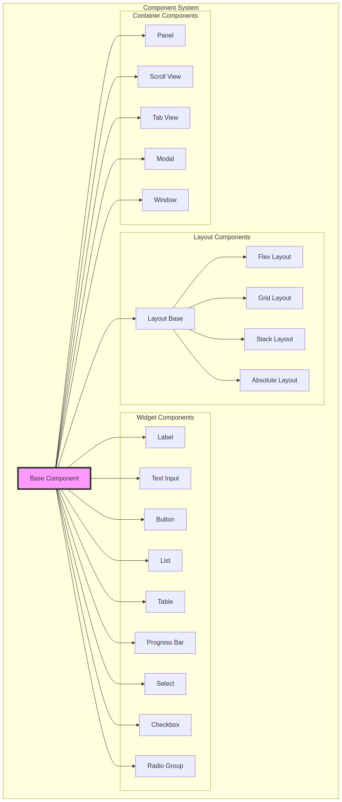

# TUI Module Design Document

## Overview

The `ekko:tui` module provides a complete component-based framework for building terminal user interfaces. It features efficient rendering, flexible layouts, rich widgets, and comprehensive event handling.

## Core Architecture

### Component System

The TUI module is built on a component-based architecture where everything is a component that can be composed, styled, and reused.

```javascript
// Base Component Class
class Component {
    constructor(props = {}) {
        // Properties
        this.props = props;
        this.state = {};
        this.context = null;

        // Hierarchy
        this.parent = null;
        this.children = [];

        // Layout
        this.bounds = { x: 0, y: 0, width: 0, height: 0 };
        this.constraints = { minWidth: 0, minHeight: 0, maxWidth: Infinity, maxHeight: Infinity };
        this.margin = { top: 0, right: 0, bottom: 0, left: 0 };
        this.padding = { top: 0, right: 0, bottom: 0, left: 0 };

        // Rendering
        this.visible = true;
        this.zIndex = 0;
        this.opacity = 1.0;
        this.isDirty = true;
        this.needsLayout = true;

        // Interaction
        this.focusable = false;
        this.focused = false;
        this.enabled = true;
        this.interactive = true;

        // Styling
        this.style = {};
        this.computedStyle = {};

        // Events
        this.eventHandlers = new Map();

        // Lifecycle
        this.mounted = false;
        this.destroyed = false;
    }

    // Lifecycle Methods
    mount() {
        if (this.mounted) return;
        this.mounted = true;
        this.onMount();
        for (const child of this.children) {
            child.mount();
        }
    }

    unmount() {
        if (!this.mounted) return;
        for (const child of this.children) {
            child.unmount();
        }
        this.onUnmount();
        this.mounted = false;
    }

    destroy() {
        if (this.destroyed) return;
        this.unmount();
        this.onDestroy();
        this.destroyed = true;
    }

    // Lifecycle Hooks (to override)
    onMount() { }
    onUnmount() { }
    onDestroy() { }

    // State Management
    setState(updates) {
        const oldState = { ...this.state };
        this.state = { ...this.state, ...updates };
        this.onStateChange(oldState, this.state);
        this.markDirty();
    }

    onStateChange(oldState, newState) { }

    // Property Updates
    setProps(updates) {
        const oldProps = { ...this.props };
        this.props = { ...this.props, ...updates };
        this.onPropsChange(oldProps, this.props);
        this.markDirty();
        this.markNeedsLayout();
    }

    onPropsChange(oldProps, newProps) { }

    // Hierarchy Management
    appendChild(child) {
        if (child.parent) {
            child.parent.removeChild(child);
        }
        this.children.push(child);
        child.parent = this;
        if (this.mounted) {
            child.mount();
        }
        this.markDirty();
        this.markNeedsLayout();
    }

    insertChild(child, index) {
        if (child.parent) {
            child.parent.removeChild(child);
        }
        this.children.splice(index, 0, child);
        child.parent = this;
        if (this.mounted) {
            child.mount();
        }
        this.markDirty();
        this.markNeedsLayout();
    }

    removeChild(child) {
        const index = this.children.indexOf(child);
        if (index !== -1) {
            this.children.splice(index, 1);
            child.parent = null;
            child.unmount();
            this.markDirty();
            this.markNeedsLayout();
        }
    }

    removeAllChildren() {
        for (const child of [...this.children]) {
            this.removeChild(child);
        }
    }

    // Layout System
    measure(constraints) {
        // Override in components to return desired size
        return {
            width: constraints.minWidth,
            height: constraints.minHeight
        };
    }

    layout(bounds) {
        this.bounds = { ...bounds };
        this.layoutChildren();
        this.needsLayout = false;
    }

    layoutChildren() {
        // Override in container components
    }

    markNeedsLayout() {
        this.needsLayout = true;
        if (this.parent) {
            this.parent.markNeedsLayout();
        }
    }

    // Rendering System
    markDirty(region = null) {
        this.isDirty = true;
        if (this.parent) {
            if (region) {
                // Transform region to parent coordinates
                const parentRegion = {
                    x: this.bounds.x + region.x,
                    y: this.bounds.y + region.y,
                    width: region.width,
                    height: region.height
                };
                this.parent.markDirty(parentRegion);
            } else {
                this.parent.markDirty(this.bounds);
            }
        }
    }

    render(buffer, clipRegion = null) {
        if (!this.visible || this.destroyed) return;

        // Apply clipping
        const effectiveClip = this.getEffectiveClipRegion(clipRegion);
        if (!effectiveClip) return;

        // Render self
        this.draw(buffer, effectiveClip);

        // Render children (sorted by z-index)
        const sortedChildren = [...this.children].sort((a, b) => a.zIndex - b.zIndex);
        for (const child of sortedChildren) {
            child.render(buffer, effectiveClip);
        }

        this.isDirty = false;
    }

    draw(buffer, clipRegion) {
        // Override in concrete components
    }

    getEffectiveClipRegion(parentClip) {
        const componentBounds = {
            x: this.bounds.x,
            y: this.bounds.y,
            width: this.bounds.width,
            height: this.bounds.height
        };

        if (!parentClip) {
            return componentBounds;
        }

        // Calculate intersection
        const x = Math.max(componentBounds.x, parentClip.x);
        const y = Math.max(componentBounds.y, parentClip.y);
        const right = Math.min(
            componentBounds.x + componentBounds.width,
            parentClip.x + parentClip.width
        );
        const bottom = Math.min(
            componentBounds.y + componentBounds.height,
            parentClip.y + parentClip.height
        );

        if (right <= x || bottom <= y) {
            return null; // No intersection
        }

        return {
            x,
            y,
            width: right - x,
            height: bottom - y
        };
    }

    // Event Handling
    on(event, handler) {
        if (!this.eventHandlers.has(event)) {
            this.eventHandlers.set(event, []);
        }
        this.eventHandlers.get(event).push(handler);
    }

    off(event, handler) {
        const handlers = this.eventHandlers.get(event);
        if (handlers) {
            const index = handlers.indexOf(handler);
            if (index !== -1) {
                handlers.splice(index, 1);
            }
        }
    }

    emit(event, data) {
        const handlers = this.eventHandlers.get(event);
        if (handlers) {
            for (const handler of handlers) {
                handler(data);
            }
        }
    }

    // Input Handling
    handleKeyPress(key, event) {
        // Override in interactive components
        return false; // Return true if handled
    }

    handleMouseEvent(event) {
        // Override in interactive components
        return false; // Return true if handled
    }

    // Focus Management
    canFocus() {
        return this.focusable && this.enabled && this.visible;
    }

    focus() {
        if (!this.canFocus()) return false;
        this.focused = true;
        this.onFocus();
        this.markDirty();
        return true;
    }

    blur() {
        if (!this.focused) return;
        this.focused = false;
        this.onBlur();
        this.markDirty();
    }

    onFocus() { }
    onBlur() { }

    // Hit Testing
    hitTest(x, y) {
        if (!this.visible || !this.interactive) return null;

        // Check bounds
        if (x < this.bounds.x || x >= this.bounds.x + this.bounds.width ||
            y < this.bounds.y || y >= this.bounds.y + this.bounds.height) {
            return null;
        }

        // Check children (in reverse z-order)
        const sortedChildren = [...this.children].sort((a, b) => b.zIndex - a.zIndex);
        for (const child of sortedChildren) {
            const hit = child.hitTest(x, y);
            if (hit) return hit;
        }

        // Return self if no child was hit
        return this;
    }

    // Styling
    computeStyle() {
        // Merge styles from various sources
        this.computedStyle = {
            ...this.getDefaultStyle(),
            ...this.props.style,
            ...this.style,
            ...(this.focused ? this.getFocusStyle() : {}),
            ...(this.props.disabled ? this.getDisabledStyle() : {})
        };
    }

    getDefaultStyle() {
        return {};
    }

    getFocusStyle() {
        return {};
    }

    getDisabledStyle() {
        return {
            opacity: 0.5
        };
    }
}
```

### Rendering System

```javascript
class Renderer {
    constructor(terminal) {
        this.terminal = terminal;
        this.primaryBuffer = null;
        this.secondaryBuffer = null;
        this.activeBuffer = 'primary';
        this.dirtyRegions = [];
        this.frameCount = 0;
        this.lastRenderTime = 0;
    }

    initialize(width, height) {
        this.primaryBuffer = new ScreenBuffer(width, height);
        this.secondaryBuffer = new ScreenBuffer(width, height);
    }

    render(rootComponent) {
        const startTime = performance.now();

        // Get current buffer
        const buffer = this.activeBuffer === 'primary'
            ? this.primaryBuffer
            : this.secondaryBuffer;

        // Clear dirty regions in buffer
        for (const region of this.dirtyRegions) {
            buffer.clearRegion(region);
        }

        // Render component tree
        rootComponent.render(buffer);

        // Calculate diff between buffers
        const changes = this.calculateDiff();

        // Apply changes to terminal
        this.applyChanges(changes);

        // Swap buffers
        this.swapBuffers();

        // Update stats
        this.frameCount++;
        this.lastRenderTime = performance.now() - startTime;

        // Clear dirty regions
        this.dirtyRegions = [];
    }

    calculateDiff() {
        const changes = [];
        const oldBuffer = this.activeBuffer === 'primary'
            ? this.secondaryBuffer
            : this.primaryBuffer;
        const newBuffer = this.activeBuffer === 'primary'
            ? this.primaryBuffer
            : this.secondaryBuffer;

        // Only check dirty regions for efficiency
        for (const region of this.dirtyRegions) {
            for (let y = region.y; y < region.y + region.height; y++) {
                for (let x = region.x; x < region.x + region.width; x++) {
                    const oldCell = oldBuffer.getCell(x, y);
                    const newCell = newBuffer.getCell(x, y);

                    if (!this.cellsEqual(oldCell, newCell)) {
                        changes.push({
                            x,
                            y,
                            cell: newCell
                        });
                    }
                }
            }
        }

        return this.optimizeChanges(changes);
    }

    cellsEqual(cell1, cell2) {
        return cell1.char === cell2.char &&
               cell1.fg === cell2.fg &&
               cell1.bg === cell2.bg &&
               cell1.attrs === cell2.attrs;
    }

    optimizeChanges(changes) {
        // Group consecutive changes in the same row
        const optimized = [];
        let current = null;

        changes.sort((a, b) => {
            if (a.y !== b.y) return a.y - b.y;
            return a.x - b.x;
        });

        for (const change of changes) {
            if (current &&
                current.y === change.y &&
                current.x + current.cells.length === change.x) {
                // Extend current group
                current.cells.push(change.cell);
            } else {
                // Start new group
                if (current) {
                    optimized.push(current);
                }
                current = {
                    x: change.x,
                    y: change.y,
                    cells: [change.cell]
                };
            }
        }

        if (current) {
            optimized.push(current);
        }

        return optimized;
    }

    applyChanges(changes) {
        for (const change of changes) {
            this.terminal.moveCursor(change.x, change.y);
            for (const cell of change.cells) {
                this.terminal.writeCell(cell);
            }
        }
    }

    swapBuffers() {
        this.activeBuffer = this.activeBuffer === 'primary' ? 'secondary' : 'primary';

        // Copy rendered content to other buffer
        const source = this.activeBuffer === 'primary'
            ? this.secondaryBuffer
            : this.primaryBuffer;
        const target = this.activeBuffer === 'primary'
            ? this.primaryBuffer
            : this.secondaryBuffer;

        for (const region of this.dirtyRegions) {
            target.copyRegion(source, region);
        }
    }

    addDirtyRegion(region) {
        // Merge with existing regions if overlapping
        this.dirtyRegions = this.mergeRegions([...this.dirtyRegions, region]);
    }

    mergeRegions(regions) {
        // Implement region merging algorithm
        // This is a simplified version
        if (regions.length <= 1) return regions;

        const merged = [];
        const sorted = regions.sort((a, b) => {
            if (a.y !== b.y) return a.y - b.y;
            return a.x - b.x;
        });

        let current = sorted[0];
        for (let i = 1; i < sorted.length; i++) {
            const region = sorted[i];
            if (this.regionsOverlap(current, region)) {
                current = this.mergeTwo(current, region);
            } else {
                merged.push(current);
                current = region;
            }
        }
        merged.push(current);

        return merged;
    }

    regionsOverlap(r1, r2) {
        return !(r1.x + r1.width < r2.x ||
                 r2.x + r2.width < r1.x ||
                 r1.y + r1.height < r2.y ||
                 r2.y + r2.height < r1.y);
    }

    mergeTwo(r1, r2) {
        const x = Math.min(r1.x, r2.x);
        const y = Math.min(r1.y, r2.y);
        const right = Math.max(r1.x + r1.width, r2.x + r2.width);
        const bottom = Math.max(r1.y + r1.height, r2.y + r2.height);

        return {
            x,
            y,
            width: right - x,
            height: bottom - y
        };
    }
}

class ScreenBuffer {
    constructor(width, height) {
        this.width = width;
        this.height = height;
        this.cells = [];

        // Initialize cells
        for (let y = 0; y < height; y++) {
            this.cells[y] = [];
            for (let x = 0; x < width; x++) {
                this.cells[y][x] = this.createEmptyCell();
            }
        }
    }

    createEmptyCell() {
        return {
            char: ' ',
            fg: 'default',
            bg: 'default',
            attrs: 0
        };
    }

    getCell(x, y) {
        if (x < 0 || x >= this.width || y < 0 || y >= this.height) {
            return this.createEmptyCell();
        }
        return this.cells[y][x];
    }

    setCell(x, y, char, fg = 'default', bg = 'default', attrs = 0) {
        if (x < 0 || x >= this.width || y < 0 || y >= this.height) {
            return;
        }

        const cell = this.cells[y][x];
        cell.char = char;
        cell.fg = fg;
        cell.bg = bg;
        cell.attrs = attrs;
    }

    drawText(x, y, text, style = {}) {
        const { fg = 'default', bg = 'default', attrs = 0 } = style;

        for (let i = 0; i < text.length; i++) {
            this.setCell(x + i, y, text[i], fg, bg, attrs);
        }
    }

    fillRect(x, y, width, height, char = ' ', style = {}) {
        const { fg = 'default', bg = 'default', attrs = 0 } = style;

        for (let dy = 0; dy < height; dy++) {
            for (let dx = 0; dx < width; dx++) {
                this.setCell(x + dx, y + dy, char, fg, bg, attrs);
            }
        }
    }

    drawBox(x, y, width, height, style = {}) {
        const {
            borderStyle = 'single',
            fg = 'default',
            bg = 'default',
            attrs = 0
        } = style;

        const chars = this.getBoxChars(borderStyle);

        // Corners
        this.setCell(x, y, chars.topLeft, fg, bg, attrs);
        this.setCell(x + width - 1, y, chars.topRight, fg, bg, attrs);
        this.setCell(x, y + height - 1, chars.bottomLeft, fg, bg, attrs);
        this.setCell(x + width - 1, y + height - 1, chars.bottomRight, fg, bg, attrs);

        // Horizontal lines
        for (let i = 1; i < width - 1; i++) {
            this.setCell(x + i, y, chars.horizontal, fg, bg, attrs);
            this.setCell(x + i, y + height - 1, chars.horizontal, fg, bg, attrs);
        }

        // Vertical lines
        for (let i = 1; i < height - 1; i++) {
            this.setCell(x, y + i, chars.vertical, fg, bg, attrs);
            this.setCell(x + width - 1, y + i, chars.vertical, fg, bg, attrs);
        }
    }

    getBoxChars(style) {
        const styles = {
            single: {
                horizontal: '─',
                vertical: '│',
                topLeft: '┌',
                topRight: '┐',
                bottomLeft: '└',
                bottomRight: '┘'
            },
            double: {
                horizontal: '═',
                vertical: '║',
                topLeft: '╔',
                topRight: '╗',
                bottomLeft: '╚',
                bottomRight: '╝'
            },
            round: {
                horizontal: '─',
                vertical: '│',
                topLeft: '╭',
                topRight: '╮',
                bottomLeft: '╰',
                bottomRight: '╯'
            },
            bold: {
                horizontal: '━',
                vertical: '┃',
                topLeft: '┏',
                topRight: '┓',
                bottomLeft: '┗',
                bottomRight: '┛'
            }
        };

        return styles[style] || styles.single;
    }

    clearRegion(region) {
        this.fillRect(region.x, region.y, region.width, region.height);
    }

    copyRegion(source, region) {
        for (let y = 0; y < region.height; y++) {
            for (let x = 0; x < region.width; x++) {
                const srcX = region.x + x;
                const srcY = region.y + y;
                const srcCell = source.getCell(srcX, srcY);
                this.cells[srcY][srcX] = { ...srcCell };
            }
        }
    }
}
```

### Layout System

```javascript
// Layout Manager Base Class
class Layout extends Component {
    layoutChildren() {
        // Override in specific layouts
    }

    getChildConstraints(child, availableSpace) {
        // Override to provide constraints to children
        return {
            minWidth: 0,
            minHeight: 0,
            maxWidth: availableSpace.width,
            maxHeight: availableSpace.height
        };
    }
}

// Flex Layout
class FlexLayout extends Layout {
    constructor(props) {
        super(props);
        this.direction = props.direction || 'horizontal';
        this.gap = props.gap || 0;
        this.alignItems = props.alignItems || 'stretch';
        this.justifyContent = props.justifyContent || 'flex-start';
        this.wrap = props.wrap || 'nowrap';
    }

    measure(constraints) {
        let totalMainSize = 0;
        let maxCrossSize = 0;

        const isHorizontal = this.direction === 'horizontal';

        // Measure children
        for (let i = 0; i < this.children.length; i++) {
            const child = this.children[i];
            const childConstraints = {
                minWidth: 0,
                minHeight: 0,
                maxWidth: isHorizontal ? Infinity : constraints.maxWidth,
                maxHeight: isHorizontal ? constraints.maxHeight : Infinity
            };

            const childSize = child.measure(childConstraints);

            if (isHorizontal) {
                totalMainSize += childSize.width;
                maxCrossSize = Math.max(maxCrossSize, childSize.height);
            } else {
                totalMainSize += childSize.height;
                maxCrossSize = Math.max(maxCrossSize, childSize.width);
            }

            if (i < this.children.length - 1) {
                totalMainSize += this.gap;
            }
        }

        return {
            width: isHorizontal ? totalMainSize : maxCrossSize,
            height: isHorizontal ? maxCrossSize : totalMainSize
        };
    }

    layoutChildren() {
        const { x, y, width, height } = this.bounds;
        const isHorizontal = this.direction === 'horizontal';

        // Calculate flex properties
        let totalFlex = 0;
        let totalFixed = 0;
        const childSizes = [];

        // First pass: measure non-flex items
        for (const child of this.children) {
            const flex = child.props.flex || 0;

            if (flex === 0) {
                const constraints = {
                    minWidth: 0,
                    minHeight: 0,
                    maxWidth: isHorizontal ? Infinity : width,
                    maxHeight: isHorizontal ? height : Infinity
                };

                const size = child.measure(constraints);
                childSizes.push(size);

                if (isHorizontal) {
                    totalFixed += size.width;
                } else {
                    totalFixed += size.height;
                }
            } else {
                totalFlex += flex;
                childSizes.push(null);
            }
        }

        // Calculate remaining space
        const totalGap = this.gap * (this.children.length - 1);
        const availableSpace = (isHorizontal ? width : height) - totalFixed - totalGap;
        const flexUnit = totalFlex > 0 ? availableSpace / totalFlex : 0;

        // Second pass: calculate flex item sizes
        for (let i = 0; i < this.children.length; i++) {
            const child = this.children[i];
            const flex = child.props.flex || 0;

            if (flex > 0 && !childSizes[i]) {
                const flexSize = flex * flexUnit;

                if (isHorizontal) {
                    childSizes[i] = {
                        width: flexSize,
                        height: height
                    };
                } else {
                    childSizes[i] = {
                        width: width,
                        height: flexSize
                    };
                }
            }
        }

        // Layout children
        let mainOffset = 0;

        // Handle justifyContent
        const totalMainSize = childSizes.reduce((sum, size) => {
            return sum + (isHorizontal ? size.width : size.height);
        }, 0) + totalGap;

        const freeSpace = (isHorizontal ? width : height) - totalMainSize;

        switch (this.justifyContent) {
            case 'center':
                mainOffset = freeSpace / 2;
                break;
            case 'flex-end':
                mainOffset = freeSpace;
                break;
            case 'space-between':
                // Handled per-item
                break;
            case 'space-around':
                mainOffset = freeSpace / (this.children.length * 2);
                break;
        }

        // Position children
        for (let i = 0; i < this.children.length; i++) {
            const child = this.children[i];
            const size = childSizes[i];

            let childX = x;
            let childY = y;
            let childWidth = size.width;
            let childHeight = size.height;

            if (isHorizontal) {
                childX += mainOffset;

                // Handle alignItems
                switch (this.alignItems) {
                    case 'center':
                        childY += (height - childHeight) / 2;
                        break;
                    case 'flex-end':
                        childY += height - childHeight;
                        break;
                    case 'stretch':
                        childHeight = height;
                        break;
                }
            } else {
                childY += mainOffset;

                // Handle alignItems
                switch (this.alignItems) {
                    case 'center':
                        childX += (width - childWidth) / 2;
                        break;
                    case 'flex-end':
                        childX += width - childWidth;
                        break;
                    case 'stretch':
                        childWidth = width;
                        break;
                }
            }

            child.layout({
                x: childX,
                y: childY,
                width: childWidth,
                height: childHeight
            });

            // Update offset
            if (isHorizontal) {
                mainOffset += childWidth + this.gap;
            } else {
                mainOffset += childHeight + this.gap;
            }

            // Handle space-between
            if (this.justifyContent === 'space-between' && i < this.children.length - 1) {
                const spacing = freeSpace / (this.children.length - 1);
                mainOffset += spacing;
            }
        }
    }
}

// Grid Layout
class GridLayout extends Layout {
    constructor(props) {
        super(props);
        this.columns = props.columns || 1;
        this.rows = props.rows || 0; // 0 = auto
        this.gap = props.gap || 0;
        this.columnGap = props.columnGap || this.gap;
        this.rowGap = props.rowGap || this.gap;
    }

    layoutChildren() {
        const { x, y, width, height } = this.bounds;

        // Calculate cell dimensions
        const cellWidth = (width - (this.columns - 1) * this.columnGap) / this.columns;
        const rows = this.rows || Math.ceil(this.children.length / this.columns);
        const cellHeight = this.rows > 0
            ? (height - (rows - 1) * this.rowGap) / rows
            : 0; // Auto height

        // Layout children
        for (let i = 0; i < this.children.length; i++) {
            const child = this.children[i];
            const col = i % this.columns;
            const row = Math.floor(i / this.columns);

            const childX = x + col * (cellWidth + this.columnGap);
            const childY = y + row * (cellHeight + this.rowGap);

            child.layout({
                x: childX,
                y: childY,
                width: cellWidth,
                height: cellHeight || child.measure({ maxWidth: cellWidth }).height
            });
        }
    }
}

// Stack Layout (overlapping children)
class StackLayout extends Layout {
    constructor(props) {
        super(props);
        this.alignment = props.alignment || 'center';
    }

    layoutChildren() {
        const { x, y, width, height } = this.bounds;

        for (const child of this.children) {
            const childSize = child.measure({
                maxWidth: width,
                maxHeight: height
            });

            let childX = x;
            let childY = y;

            // Handle alignment
            switch (this.alignment) {
                case 'top-left':
                    // Default position
                    break;
                case 'top':
                    childX += (width - childSize.width) / 2;
                    break;
                case 'top-right':
                    childX += width - childSize.width;
                    break;
                case 'left':
                    childY += (height - childSize.height) / 2;
                    break;
                case 'center':
                    childX += (width - childSize.width) / 2;
                    childY += (height - childSize.height) / 2;
                    break;
                case 'right':
                    childX += width - childSize.width;
                    childY += (height - childSize.height) / 2;
                    break;
                case 'bottom-left':
                    childY += height - childSize.height;
                    break;
                case 'bottom':
                    childX += (width - childSize.width) / 2;
                    childY += height - childSize.height;
                    break;
                case 'bottom-right':
                    childX += width - childSize.width;
                    childY += height - childSize.height;
                    break;
            }

            child.layout({
                x: childX,
                y: childY,
                width: childSize.width,
                height: childSize.height
            });
        }
    }
}
```

### Widget Library

```javascript
// Text Components
class Label extends Component {
    constructor(props) {
        super(props);
        this.text = props.text || '';
        this.align = props.align || 'left';
        this.wrap = props.wrap || false;
        this.truncate = props.truncate || false;
    }

    measure(constraints) {
        const lines = this.wrap
            ? this.wrapText(this.text, constraints.maxWidth)
            : [this.text];

        const width = Math.max(...lines.map(line => line.length));
        const height = lines.length;

        return {
            width: Math.min(width, constraints.maxWidth),
            height: Math.min(height, constraints.maxHeight)
        };
    }

    draw(buffer, clipRegion) {
        const { x, y, width, height } = this.bounds;
        const style = this.computedStyle;

        const lines = this.wrap
            ? this.wrapText(this.text, width)
            : [this.text];

        for (let i = 0; i < Math.min(lines.length, height); i++) {
            let line = lines[i];

            // Truncate if needed
            if (line.length > width) {
                if (this.truncate) {
                    line = line.substring(0, width - 3) + '...';
                } else {
                    line = line.substring(0, width);
                }
            }

            // Calculate alignment
            let textX = x;
            if (this.align === 'center') {
                textX += Math.floor((width - line.length) / 2);
            } else if (this.align === 'right') {
                textX += width - line.length;
            }

            buffer.drawText(textX, y + i, line, style);
        }
    }

    wrapText(text, maxWidth) {
        const words = text.split(' ');
        const lines = [];
        let currentLine = '';

        for (const word of words) {
            if (currentLine.length + word.length + 1 <= maxWidth) {
                currentLine += (currentLine ? ' ' : '') + word;
            } else {
                if (currentLine) lines.push(currentLine);
                currentLine = word;
            }
        }

        if (currentLine) lines.push(currentLine);
        return lines;
    }
}

// Input Components
class TextInput extends Component {
    constructor(props) {
        super(props);
        this.value = props.value || '';
        this.placeholder = props.placeholder || '';
        this.maxLength = props.maxLength || Infinity;
        this.mask = props.mask || null;
        this.validator = props.validator || null;

        this.cursorPosition = this.value.length;
        this.selectionStart = -1;
        this.selectionEnd = -1;
        this.scrollOffset = 0;

        this.focusable = true;
    }

    draw(buffer, clipRegion) {
        const { x, y, width, height } = this.bounds;
        const style = this.computedStyle;

        // Draw border
        if (style.border) {
            buffer.drawBox(x, y, width, height, {
                borderStyle: style.borderStyle || 'single',
                fg: this.focused ? style.focusBorderColor : style.borderColor
            });
        }

        // Calculate text area
        const textX = x + (style.border ? 1 : 0);
        const textY = y + (style.border ? 1 : 0);
        const textWidth = width - (style.border ? 2 : 0);

        // Prepare text
        let displayText = this.value || this.placeholder;
        let textStyle = { ...style };

        if (!this.value && this.placeholder) {
            textStyle.fg = style.placeholderColor || 'gray';
        }

        // Apply mask
        if (this.mask && this.value) {
            displayText = this.mask.repeat(this.value.length);
        }

        // Handle scrolling
        if (this.cursorPosition < this.scrollOffset) {
            this.scrollOffset = this.cursorPosition;
        } else if (this.cursorPosition >= this.scrollOffset + textWidth) {
            this.scrollOffset = this.cursorPosition - textWidth + 1;
        }

        // Draw text
        const visibleText = displayText.substring(
            this.scrollOffset,
            this.scrollOffset + textWidth
        );
        buffer.drawText(textX, textY, visibleText, textStyle);

        // Draw cursor
        if (this.focused && !this.mask) {
            const cursorX = textX + this.cursorPosition - this.scrollOffset;
            if (cursorX >= textX && cursorX < textX + textWidth) {
                buffer.setCell(cursorX, textY, '│', style.cursorColor || 'white');
            }
        }

        // Draw selection
        if (this.selectionStart !== -1 && this.selectionEnd !== -1) {
            const start = Math.max(this.selectionStart - this.scrollOffset, 0);
            const end = Math.min(this.selectionEnd - this.scrollOffset, textWidth);

            for (let i = start; i < end; i++) {
                const char = visibleText[i] || ' ';
                buffer.setCell(textX + i, textY, char,
                    style.selectionFg || 'black',
                    style.selectionBg || 'white'
                );
            }
        }
    }

    handleKeyPress(key, event) {
        if (!this.focused || !this.enabled) return false;

        // Handle special keys
        switch (key) {
            case 'left':
                this.moveCursor(-1, event.shift);
                return true;

            case 'right':
                this.moveCursor(1, event.shift);
                return true;

            case 'home':
                this.moveCursor(-this.cursorPosition, event.shift);
                return true;

            case 'end':
                this.moveCursor(this.value.length - this.cursorPosition, event.shift);
                return true;

            case 'backspace':
                this.deleteBackward();
                return true;

            case 'delete':
                this.deleteForward();
                return true;

            case 'enter':
                this.emit('submit', this.value);
                return true;
        }

        // Handle character input
        if (key.length === 1 && this.value.length < this.maxLength) {
            this.insertChar(key);
            return true;
        }

        return false;
    }

    insertChar(char) {
        if (this.selectionStart !== -1) {
            this.deleteSelection();
        }

        this.value =
            this.value.slice(0, this.cursorPosition) +
            char +
            this.value.slice(this.cursorPosition);

        this.cursorPosition++;
        this.emit('change', this.value);
        this.markDirty();
    }

    deleteBackward() {
        if (this.selectionStart !== -1) {
            this.deleteSelection();
        } else if (this.cursorPosition > 0) {
            this.value =
                this.value.slice(0, this.cursorPosition - 1) +
                this.value.slice(this.cursorPosition);
            this.cursorPosition--;
            this.emit('change', this.value);
            this.markDirty();
        }
    }

    deleteForward() {
        if (this.selectionStart !== -1) {
            this.deleteSelection();
        } else if (this.cursorPosition < this.value.length) {
            this.value =
                this.value.slice(0, this.cursorPosition) +
                this.value.slice(this.cursorPosition + 1);
            this.emit('change', this.value);
            this.markDirty();
        }
    }

    deleteSelection() {
        const start = Math.min(this.selectionStart, this.selectionEnd);
        const end = Math.max(this.selectionStart, this.selectionEnd);

        this.value = this.value.slice(0, start) + this.value.slice(end);
        this.cursorPosition = start;
        this.selectionStart = -1;
        this.selectionEnd = -1;
        this.emit('change', this.value);
        this.markDirty();
    }

    moveCursor(delta, selecting = false) {
        const newPosition = Math.max(0,
            Math.min(this.value.length, this.cursorPosition + delta)
        );

        if (selecting) {
            if (this.selectionStart === -1) {
                this.selectionStart = this.cursorPosition;
                this.selectionEnd = newPosition;
            } else {
                this.selectionEnd = newPosition;
            }
        } else {
            this.selectionStart = -1;
            this.selectionEnd = -1;
        }

        this.cursorPosition = newPosition;
        this.markDirty();
    }
}

// Button Component
class Button extends Component {
    constructor(props) {
        super(props);
        this.label = props.label || 'Button';
        this.onClick = props.onClick || (() => {});
        this.variant = props.variant || 'default';
        this.size = props.size || 'medium';

        this.focusable = true;
    }

    measure(constraints) {
        const padding = this.getPadding();
        return {
            width: this.label.length + padding.left + padding.right,
            height: 1 + padding.top + padding.bottom
        };
    }

    draw(buffer, clipRegion) {
        const { x, y, width, height } = this.bounds;
        const style = this.getButtonStyle();
        const padding = this.getPadding();

        // Draw background
        buffer.fillRect(x, y, width, height, ' ', style);

        // Draw border if focused
        if (this.focused) {
            buffer.drawBox(x, y, width, height, {
                borderStyle: 'single',
                fg: style.focusBorderColor || 'yellow'
            });
        }

        // Draw label
        const labelX = x + Math.floor((width - this.label.length) / 2);
        const labelY = y + Math.floor(height / 2);
        buffer.drawText(labelX, labelY, this.label, style);
    }

    handleKeyPress(key, event) {
        if (!this.focused || !this.enabled) return false;

        if (key === 'enter' || key === ' ') {
            this.press();
            return true;
        }

        return false;
    }

    handleMouseEvent(event) {
        if (!this.enabled) return false;

        if (event.type === 'click') {
            this.press();
            return true;
        }

        return false;
    }

    press() {
        this.emit('click');
        this.onClick();

        // Visual feedback
        this.setState({ pressed: true });
        setTimeout(() => {
            this.setState({ pressed: false });
        }, 100);
    }

    getButtonStyle() {
        const baseStyle = this.computedStyle;
        const variantStyles = {
            default: { fg: 'white', bg: 'blue' },
            primary: { fg: 'white', bg: 'green' },
            danger: { fg: 'white', bg: 'red' },
            secondary: { fg: 'black', bg: 'gray' }
        };

        return {
            ...baseStyle,
            ...variantStyles[this.variant],
            ...(this.state.pressed ? { bg: 'darkgray' } : {})
        };
    }

    getPadding() {
        const sizes = {
            small: { top: 0, right: 2, bottom: 0, left: 2 },
            medium: { top: 1, right: 4, bottom: 1, left: 4 },
            large: { top: 2, right: 6, bottom: 2, left: 6 }
        };

        return sizes[this.size];
    }
}

// List Component
class List extends Component {
    constructor(props) {
        super(props);
        this.items = props.items || [];
        this.renderItem = props.renderItem || ((item) => item.toString());
        this.onSelect = props.onSelect || (() => {});
        this.multiSelect = props.multiSelect || false;

        this.selectedIndex = -1;
        this.selectedIndices = new Set();
        this.scrollOffset = 0;

        this.focusable = true;
    }

    draw(buffer, clipRegion) {
        const { x, y, width, height } = this.bounds;
        const style = this.computedStyle;

        // Draw border
        if (style.border) {
            buffer.drawBox(x, y, width, height, {
                borderStyle: style.borderStyle || 'single',
                fg: this.focused ? style.focusBorderColor : style.borderColor
            });
        }

        // Calculate content area
        const contentX = x + (style.border ? 1 : 0);
        const contentY = y + (style.border ? 1 : 0);
        const contentWidth = width - (style.border ? 2 : 0);
        const contentHeight = height - (style.border ? 2 : 0);

        // Draw visible items
        const visibleItems = Math.min(contentHeight, this.items.length - this.scrollOffset);

        for (let i = 0; i < visibleItems; i++) {
            const itemIndex = this.scrollOffset + i;
            const item = this.items[itemIndex];
            const itemY = contentY + i;

            // Determine item style
            let itemStyle = { ...style };
            if (this.multiSelect && this.selectedIndices.has(itemIndex)) {
                itemStyle.bg = style.selectedBg || 'blue';
                itemStyle.fg = style.selectedFg || 'white';
            } else if (!this.multiSelect && itemIndex === this.selectedIndex) {
                itemStyle.bg = style.selectedBg || 'blue';
                itemStyle.fg = style.selectedFg || 'white';
            }

            // Clear line
            buffer.fillRect(contentX, itemY, contentWidth, 1, ' ', itemStyle);

            // Render item
            const itemText = this.renderItem(item, itemIndex);
            const truncatedText = itemText.length > contentWidth
                ? itemText.substring(0, contentWidth - 3) + '...'
                : itemText;

            buffer.drawText(contentX, itemY, truncatedText, itemStyle);
        }

        // Draw scrollbar if needed
        if (this.items.length > contentHeight) {
            this.drawScrollbar(buffer,
                x + width - 1,
                contentY,
                contentHeight,
                this.scrollOffset,
                this.items.length
            );
        }
    }

    drawScrollbar(buffer, x, y, height, offset, total) {
        const thumbSize = Math.max(1, Math.floor(height * height / total));
        const thumbPosition = Math.floor((height - thumbSize) * offset / (total - height));

        // Draw track
        for (let i = 0; i < height; i++) {
            buffer.setCell(x, y + i, '│', 'gray');
        }

        // Draw thumb
        for (let i = 0; i < thumbSize; i++) {
            if (y + thumbPosition + i < y + height) {
                buffer.setCell(x, y + thumbPosition + i, '█', 'white');
            }
        }
    }

    handleKeyPress(key, event) {
        if (!this.focused || !this.enabled) return false;

        switch (key) {
            case 'up':
                this.moveSelection(-1);
                return true;

            case 'down':
                this.moveSelection(1);
                return true;

            case 'home':
                this.setSelection(0);
                return true;

            case 'end':
                this.setSelection(this.items.length - 1);
                return true;

            case 'pageup':
                this.moveSelection(-10);
                return true;

            case 'pagedown':
                this.moveSelection(10);
                return true;

            case 'enter':
                this.selectCurrent();
                return true;

            case ' ':
                if (this.multiSelect) {
                    this.toggleCurrent();
                    return true;
                }
                break;
        }

        return false;
    }

    moveSelection(delta) {
        const newIndex = Math.max(0,
            Math.min(this.items.length - 1, this.selectedIndex + delta)
        );
        this.setSelection(newIndex);
    }

    setSelection(index) {
        this.selectedIndex = index;
        this.ensureVisible(index);
        this.markDirty();
    }

    ensureVisible(index) {
        const contentHeight = this.bounds.height - (this.computedStyle.border ? 2 : 0);

        if (index < this.scrollOffset) {
            this.scrollOffset = index;
        } else if (index >= this.scrollOffset + contentHeight) {
            this.scrollOffset = index - contentHeight + 1;
        }
    }

    selectCurrent() {
        if (this.selectedIndex >= 0 && this.selectedIndex < this.items.length) {
            const item = this.items[this.selectedIndex];
            this.emit('select', { item, index: this.selectedIndex });
            this.onSelect(item, this.selectedIndex);
        }
    }

    toggleCurrent() {
        if (this.selectedIndex >= 0 && this.selectedIndex < this.items.length) {
            if (this.selectedIndices.has(this.selectedIndex)) {
                this.selectedIndices.delete(this.selectedIndex);
            } else {
                this.selectedIndices.add(this.selectedIndex);
            }
            this.markDirty();
            this.emit('selectionChange', Array.from(this.selectedIndices));
        }
    }
}

// Table Component
class Table extends Component {
    constructor(props) {
        super(props);
        this.columns = props.columns || [];
        this.data = props.data || [];
        this.headers = props.headers !== false;
        this.borders = props.borders !== false;
        this.selectable = props.selectable || false;

        this.selectedRow = -1;
        this.scrollOffset = 0;
        this.columnWidths = [];

        this.focusable = this.selectable;

        this.calculateColumnWidths();
    }

    calculateColumnWidths() {
        this.columnWidths = this.columns.map(col => col.width || 10);

        // Auto-calculate widths if not specified
        for (let i = 0; i < this.columns.length; i++) {
            if (!this.columns[i].width) {
                let maxWidth = this.columns[i].label?.length || 0;

                for (const row of this.data) {
                    const value = this.getCellValue(row, this.columns[i]);
                    maxWidth = Math.max(maxWidth, value.toString().length);
                }

                this.columnWidths[i] = Math.min(maxWidth + 2, 30);
            }
        }
    }

    draw(buffer, clipRegion) {
        const { x, y, width, height } = this.bounds;
        const style = this.computedStyle;

        let currentY = y;
        let contentHeight = height;

        // Draw header
        if (this.headers) {
            this.drawHeader(buffer, x, currentY, width);
            currentY += this.borders ? 3 : 1;
            contentHeight -= this.borders ? 3 : 1;
        }

        // Draw rows
        const visibleRows = Math.min(
            contentHeight - (this.borders ? 1 : 0),
            this.data.length - this.scrollOffset
        );

        for (let i = 0; i < visibleRows; i++) {
            const rowIndex = this.scrollOffset + i;
            const row = this.data[rowIndex];

            this.drawRow(buffer, x, currentY, width, row, rowIndex);
            currentY += 1;

            if (this.borders && i < visibleRows - 1) {
                this.drawRowSeparator(buffer, x, currentY, width);
                currentY += 1;
            }
        }

        // Draw bottom border
        if (this.borders) {
            this.drawBottomBorder(buffer, x, currentY, width);
        }
    }

    drawHeader(buffer, x, y, width) {
        const style = {
            ...this.computedStyle,
            fg: this.computedStyle.headerFg || 'white',
            bg: this.computedStyle.headerBg || 'blue',
            attrs: 1 // bold
        };

        // Top border
        if (this.borders) {
            buffer.setCell(x, y, '┌');
            let currentX = x + 1;

            for (let i = 0; i < this.columns.length; i++) {
                const colWidth = this.columnWidths[i];
                for (let j = 0; j < colWidth; j++) {
                    buffer.setCell(currentX++, y, '─');
                }

                if (i < this.columns.length - 1) {
                    buffer.setCell(currentX++, y, '┬');
                }
            }

            buffer.setCell(currentX, y, '┐');
            y++;
        }

        // Header content
        let currentX = x + (this.borders ? 1 : 0);

        for (let i = 0; i < this.columns.length; i++) {
            const col = this.columns[i];
            const colWidth = this.columnWidths[i];

            buffer.fillRect(currentX, y, colWidth, 1, ' ', style);

            const label = col.label || col.key;
            const truncated = label.length > colWidth - 2
                ? label.substring(0, colWidth - 5) + '...'
                : label;

            const labelX = currentX + Math.floor((colWidth - truncated.length) / 2);
            buffer.drawText(labelX, y, truncated, style);

            currentX += colWidth;

            if (this.borders && i < this.columns.length - 1) {
                buffer.setCell(currentX, y, '│');
                currentX++;
            }
        }

        if (this.borders) {
            buffer.setCell(currentX, y, '│');
        }
    }

    drawRow(buffer, x, y, width, row, rowIndex) {
        const isSelected = this.selectable && rowIndex === this.selectedRow;
        const style = {
            ...this.computedStyle,
            bg: isSelected ? (this.computedStyle.selectedBg || 'blue') : this.computedStyle.bg,
            fg: isSelected ? (this.computedStyle.selectedFg || 'white') : this.computedStyle.fg
        };

        let currentX = x + (this.borders ? 1 : 0);

        for (let i = 0; i < this.columns.length; i++) {
            const col = this.columns[i];
            const colWidth = this.columnWidths[i];

            buffer.fillRect(currentX, y, colWidth, 1, ' ', style);

            const value = this.getCellValue(row, col);
            const formatted = col.format ? col.format(value) : value.toString();
            const truncated = formatted.length > colWidth - 2
                ? formatted.substring(0, colWidth - 5) + '...'
                : formatted;

            // Align text
            let textX = currentX + 1;
            if (col.align === 'center') {
                textX = currentX + Math.floor((colWidth - truncated.length) / 2);
            } else if (col.align === 'right') {
                textX = currentX + colWidth - truncated.length - 1;
            }

            buffer.drawText(textX, y, truncated, style);

            currentX += colWidth;

            if (this.borders && i < this.columns.length - 1) {
                buffer.setCell(currentX, y, '│', this.computedStyle);
                currentX++;
            }
        }

        if (this.borders) {
            buffer.setCell(x, y, '│', this.computedStyle);
            buffer.setCell(currentX, y, '│', this.computedStyle);
        }
    }

    drawRowSeparator(buffer, x, y, width) {
        buffer.setCell(x, y, '├');
        let currentX = x + 1;

        for (let i = 0; i < this.columns.length; i++) {
            const colWidth = this.columnWidths[i];
            for (let j = 0; j < colWidth; j++) {
                buffer.setCell(currentX++, y, '─');
            }

            if (i < this.columns.length - 1) {
                buffer.setCell(currentX++, y, '┼');
            }
        }

        buffer.setCell(currentX, y, '┤');
    }

    drawBottomBorder(buffer, x, y, width) {
        buffer.setCell(x, y, '└');
        let currentX = x + 1;

        for (let i = 0; i < this.columns.length; i++) {
            const colWidth = this.columnWidths[i];
            for (let j = 0; j < colWidth; j++) {
                buffer.setCell(currentX++, y, '─');
            }

            if (i < this.columns.length - 1) {
                buffer.setCell(currentX++, y, '┴');
            }
        }

        buffer.setCell(currentX, y, '┘');
    }

    getCellValue(row, column) {
        if (column.getValue) {
            return column.getValue(row);
        }
        return row[column.key];
    }

    handleKeyPress(key, event) {
        if (!this.focused || !this.enabled || !this.selectable) return false;

        switch (key) {
            case 'up':
                this.moveSelection(-1);
                return true;

            case 'down':
                this.moveSelection(1);
                return true;

            case 'home':
                this.setSelection(0);
                return true;

            case 'end':
                this.setSelection(this.data.length - 1);
                return true;

            case 'enter':
                this.selectCurrent();
                return true;
        }

        return false;
    }

    moveSelection(delta) {
        const newIndex = Math.max(0,
            Math.min(this.data.length - 1, this.selectedRow + delta)
        );
        this.setSelection(newIndex);
    }

    setSelection(index) {
        this.selectedRow = index;
        this.ensureVisible(index);
        this.markDirty();
    }

    ensureVisible(index) {
        const headerHeight = this.headers ? (this.borders ? 3 : 1) : 0;
        const contentHeight = this.bounds.height - headerHeight - (this.borders ? 1 : 0);

        if (index < this.scrollOffset) {
            this.scrollOffset = index;
        } else if (index >= this.scrollOffset + contentHeight) {
            this.scrollOffset = index - contentHeight + 1;
        }
    }

    selectCurrent() {
        if (this.selectedRow >= 0 && this.selectedRow < this.data.length) {
            const row = this.data[this.selectedRow];
            this.emit('select', { row, index: this.selectedRow });
        }
    }
}
```

### Event System

```javascript
class EventDispatcher {
    constructor() {
        this.keyHandlers = new Map();
        this.mouseHandlers = new Map();
        this.focusManager = null;
        this.captureComponent = null;
    }

    setFocusManager(focusManager) {
        this.focusManager = focusManager;
    }

    // Keyboard Events
    dispatchKeyEvent(event) {
        // Check capture
        if (this.captureComponent) {
            if (this.captureComponent.handleKeyPress(event.key, event)) {
                return;
            }
        }

        // Check focused component
        const focused = this.focusManager?.getCurrentFocus();
        if (focused && focused.handleKeyPress(event.key, event)) {
            return;
        }

        // Bubble up from focused
        let component = focused?.parent;
        while (component) {
            if (component.handleKeyPress(event.key, event)) {
                return;
            }
            component = component.parent;
        }

        // Global handlers
        const handlers = this.keyHandlers.get(event.key) || [];
        for (const handler of handlers) {
            if (handler(event)) {
                return;
            }
        }
    }

    onKey(key, handler) {
        if (!this.keyHandlers.has(key)) {
            this.keyHandlers.set(key, []);
        }
        this.keyHandlers.get(key).push(handler);
    }

    offKey(key, handler) {
        const handlers = this.keyHandlers.get(key);
        if (handlers) {
            const index = handlers.indexOf(handler);
            if (index !== -1) {
                handlers.splice(index, 1);
            }
        }
    }

    // Mouse Events
    dispatchMouseEvent(event) {
        // Find component at position
        const target = this.findComponentAt(event.x, event.y);

        if (event.type === 'mousedown') {
            // Handle focus change
            if (target && target.focusable) {
                this.focusManager?.setFocus(target);
            }
        }

        // Dispatch to target
        if (target && target.handleMouseEvent(event)) {
            return;
        }

        // Bubble up
        let component = target?.parent;
        while (component) {
            if (component.handleMouseEvent(event)) {
                return;
            }
            component = component.parent;
        }
    }

    findComponentAt(x, y, root = null) {
        if (!root) {
            root = this.focusManager?.root;
            if (!root) return null;
        }

        const hit = root.hitTest(x, y);
        return hit;
    }

    // Capture
    setCapture(component) {
        this.captureComponent = component;
    }

    releaseCapture() {
        this.captureComponent = null;
    }
}

class FocusManager {
    constructor(root) {
        this.root = root;
        this.focusableComponents = [];
        this.currentFocus = null;
        this.focusHistory = [];

        this.buildFocusableList();
    }

    buildFocusableList() {
        this.focusableComponents = [];
        this.collectFocusable(this.root);
    }

    collectFocusable(component) {
        if (component.canFocus()) {
            this.focusableComponents.push(component);
        }

        for (const child of component.children) {
            this.collectFocusable(child);
        }
    }

    getCurrentFocus() {
        return this.currentFocus;
    }

    setFocus(component) {
        if (component === this.currentFocus) return;

        if (this.currentFocus) {
            this.currentFocus.blur();
            this.focusHistory.push(this.currentFocus);
        }

        this.currentFocus = component;

        if (component) {
            component.focus();
        }
    }

    focusNext() {
        this.buildFocusableList();

        if (this.focusableComponents.length === 0) return;

        let index = -1;
        if (this.currentFocus) {
            index = this.focusableComponents.indexOf(this.currentFocus);
        }

        index = (index + 1) % this.focusableComponents.length;
        this.setFocus(this.focusableComponents[index]);
    }

    focusPrevious() {
        this.buildFocusableList();

        if (this.focusableComponents.length === 0) return;

        let index = 0;
        if (this.currentFocus) {
            index = this.focusableComponents.indexOf(this.currentFocus);
        }

        index = (index - 1 + this.focusableComponents.length) % this.focusableComponents.length;
        this.setFocus(this.focusableComponents[index]);
    }

    focusFirst() {
        this.buildFocusableList();
        if (this.focusableComponents.length > 0) {
            this.setFocus(this.focusableComponents[0]);
        }
    }

    focusLast() {
        this.buildFocusableList();
        if (this.focusableComponents.length > 0) {
            this.setFocus(this.focusableComponents[this.focusableComponents.length - 1]);
        }
    }

    restoreFocus() {
        if (this.focusHistory.length > 0) {
            const previous = this.focusHistory.pop();
            this.setFocus(previous);
        }
    }
}
```

### Application Framework

```javascript
class Application {
    constructor(options = {}) {
        this.title = options.title || 'TUI Application';
        this.theme = options.theme || 'default';
        this.fps = options.fps || 60;

        this.terminal = new Terminal();
        this.renderer = new Renderer(this.terminal);
        this.root = new Component();
        this.focusManager = new FocusManager(this.root);
        this.eventDispatcher = new EventDispatcher();
        this.eventDispatcher.setFocusManager(this.focusManager);

        this.running = false;
        this.frameTime = 1000 / this.fps;
        this.lastFrameTime = 0;
        this.animationFrameId = null;

        this.setupEventHandlers();
    }

    setupEventHandlers() {
        // Terminal resize
        this.terminal.on('resize', (size) => {
            this.handleResize(size);
        });

        // Keyboard input
        this.terminal.on('key', (key, event) => {
            this.eventDispatcher.dispatchKeyEvent({ key, ...event });
        });

        // Mouse input
        this.terminal.on('mouse', (event) => {
            this.eventDispatcher.dispatchMouseEvent(event);
        });

        // Global keyboard shortcuts
        this.eventDispatcher.onKey('tab', (event) => {
            if (event.shift) {
                this.focusManager.focusPrevious();
            } else {
                this.focusManager.focusNext();
            }
            return true;
        });

        this.eventDispatcher.onKey('escape', (event) => {
            if (this.onEscape) {
                return this.onEscape();
            }
            return false;
        });
    }

    mount(component) {
        this.root.appendChild(component);
        component.mount();
        this.layout();
    }

    unmount(component) {
        this.root.removeChild(component);
        this.layout();
    }

    run() {
        if (this.running) return;

        this.running = true;

        // Initialize terminal
        this.terminal.initialize();
        this.terminal.enterAlternateScreen();
        this.terminal.hideCursor();
        this.terminal.enableMouse();

        // Get initial size
        const size = this.terminal.getSize();
        this.renderer.initialize(size.width, size.height);

        // Initial layout
        this.handleResize(size);

        // Start render loop
        this.renderLoop();

        // Handle exit
        process.on('SIGINT', () => {
            this.stop();
            process.exit(0);
        });
    }

    stop() {
        if (!this.running) return;

        this.running = false;

        // Cancel animation frame
        if (this.animationFrameId) {
            cancelAnimationFrame(this.animationFrameId);
        }

        // Restore terminal
        this.terminal.exitAlternateScreen();
        this.terminal.showCursor();
        this.terminal.disableMouse();
        this.terminal.cleanup();
    }

    renderLoop() {
        if (!this.running) return;

        const now = performance.now();
        const deltaTime = now - this.lastFrameTime;

        if (deltaTime >= this.frameTime) {
            this.render();
            this.lastFrameTime = now - (deltaTime % this.frameTime);
        }

        this.animationFrameId = requestAnimationFrame(() => this.renderLoop());
    }

    render() {
        // Layout if needed
        if (this.root.needsLayout) {
            this.layout();
        }

        // Render
        this.renderer.render(this.root);
    }

    layout() {
        const size = this.terminal.getSize();
        this.root.layout({
            x: 0,
            y: 0,
            width: size.width,
            height: size.height
        });
    }

    handleResize(size) {
        this.renderer.initialize(size.width, size.height);
        this.layout();
        this.root.markDirty();
    }
}

// Helper function to create application
function createApp(options) {
    return new Application(options);
}
```

## Architecture Diagrams

### Component Hierarchy





### Rendering Pipeline


### Event Flow


### Layout System


### State Management


### Buffer Management


## Usage Examples

### Basic Application

```javascript
import tui from 'ekko:tui';

// Create application
const app = tui.createApp({
    title: 'My TUI App',
    theme: 'dark'
});

// Create layout
const layout = new tui.FlexLayout({
    direction: 'vertical',
    gap: 1
});

// Create header
const header = new tui.Panel({
    height: 3,
    style: {
        border: true,
        borderStyle: 'double',
        borderColor: 'cyan'
    }
});

const title = new tui.Label({
    text: 'My Application',
    align: 'center',
    style: {
        fg: 'yellow',
        attrs: 1 // bold
    }
});

header.appendChild(title);

// Create main content area
const content = new tui.FlexLayout({
    direction: 'horizontal',
    flex: 1,
    gap: 1
});

// Sidebar
const sidebar = new tui.List({
    items: ['Dashboard', 'Users', 'Settings', 'Help'],
    width: 20,
    style: {
        border: true,
        borderColor: 'gray'
    },
    onSelect: (item) => {
        updateMainPanel(item);
    }
});

// Main panel
const mainPanel = new tui.Panel({
    flex: 1,
    style: {
        border: true,
        borderColor: 'gray'
    }
});

content.appendChild(sidebar);
content.appendChild(mainPanel);

// Status bar
const statusBar = new tui.FlexLayout({
    direction: 'horizontal',
    height: 1,
    style: {
        bg: 'blue',
        fg: 'white'
    }
});

const statusText = new tui.Label({
    text: 'Ready',
    flex: 1
});

const clock = new tui.Label({
    text: new Date().toLocaleTimeString(),
    align: 'right'
});

statusBar.appendChild(statusText);
statusBar.appendChild(clock);

// Assemble layout
layout.appendChild(header);
layout.appendChild(content);
layout.appendChild(statusBar);

// Mount and run
app.mount(layout);
app.run();

// Update clock
setInterval(() => {
    clock.setText(new Date().toLocaleTimeString());
}, 1000);
```

### Form Example

```javascript
// Create a form
const form = new tui.Panel({
    padding: 2,
    style: {
        border: true,
        borderStyle: 'round'
    }
});

const formLayout = new tui.FlexLayout({
    direction: 'vertical',
    gap: 1
});

// Username field
const usernameLabel = new tui.Label({ text: 'Username:' });
const usernameInput = new tui.TextInput({
    placeholder: 'Enter username',
    maxLength: 20,
    validator: (value) => {
        if (value.length < 3) {
            return 'Username must be at least 3 characters';
        }
        return true;
    }
});

// Password field
const passwordLabel = new tui.Label({ text: 'Password:' });
const passwordInput = new tui.TextInput({
    placeholder: 'Enter password',
    mask: '*',
    validator: (value) => {
        if (value.length < 8) {
            return 'Password must be at least 8 characters';
        }
        return true;
    }
});

// Remember me checkbox
const rememberMe = new tui.Checkbox({
    label: 'Remember me',
    checked: false
});

// Button row
const buttonRow = new tui.FlexLayout({
    direction: 'horizontal',
    gap: 2,
    justifyContent: 'flex-end'
});

const cancelButton = new tui.Button({
    label: 'Cancel',
    variant: 'secondary',
    onClick: () => {
        app.stop();
    }
});

const loginButton = new tui.Button({
    label: 'Login',
    variant: 'primary',
    onClick: async () => {
        const username = usernameInput.getValue();
        const password = passwordInput.getValue();

        if (await login(username, password)) {
            showMainScreen();
        } else {
            showError('Invalid credentials');
        }
    }
});

buttonRow.appendChild(cancelButton);
buttonRow.appendChild(loginButton);

// Assemble form
formLayout.appendChild(usernameLabel);
formLayout.appendChild(usernameInput);
formLayout.appendChild(passwordLabel);
formLayout.appendChild(passwordInput);
formLayout.appendChild(rememberMe);
formLayout.appendChild(buttonRow);

form.appendChild(formLayout);
```

### Data Table Example

```javascript
// Create table with data
const userTable = new tui.Table({
    columns: [
        {
            key: 'id',
            label: 'ID',
            width: 6,
            align: 'right'
        },
        {
            key: 'name',
            label: 'Name',
            width: 20
        },
        {
            key: 'email',
            label: 'Email',
            width: 30
        },
        {
            key: 'status',
            label: 'Status',
            width: 10,
            align: 'center',
            format: (value) => {
                return value === 'active'
                    ? tui.style({ fg: 'green' })(value)
                    : tui.style({ fg: 'red' })(value);
            }
        }
    ],
    data: [
        { id: 1, name: 'John Doe', email: 'john@example.com', status: 'active' },
        { id: 2, name: 'Jane Smith', email: 'jane@example.com', status: 'inactive' },
        { id: 3, name: 'Bob Johnson', email: 'bob@example.com', status: 'active' }
    ],
    selectable: true,
    style: {
        headerBg: 'blue',
        headerFg: 'white',
        selectedBg: 'cyan',
        selectedFg: 'black'
    }
});

userTable.on('select', ({ row }) => {
    showUserDetails(row);
});

// Add pagination
const pagination = new tui.FlexLayout({
    direction: 'horizontal',
    justifyContent: 'center',
    gap: 2
});

const prevButton = new tui.Button({
    label: '< Previous',
    size: 'small',
    onClick: () => userTable.previousPage()
});

const pageInfo = new tui.Label({
    text: 'Page 1 of 10'
});

const nextButton = new tui.Button({
    label: 'Next >',
    size: 'small',
    onClick: () => userTable.nextPage()
});

pagination.appendChild(prevButton);
pagination.appendChild(pageInfo);
pagination.appendChild(nextButton);
```

## Performance Optimizations

1. **Dirty Region Tracking**: Only redraw changed areas
2. **Double Buffering**: Prevent flicker with buffer swapping
3. **Diff Algorithm**: Minimize terminal writes
4. **Layout Caching**: Cache layout calculations
5. **Event Delegation**: Efficient event handling
6. **Virtual Scrolling**: Handle large lists efficiently
7. **Batch Updates**: Group multiple state changes

## Best Practices

1. **Component Composition**: Build complex UIs from simple components
2. **State Management**: Keep state in parent components when possible
3. **Event Handling**: Use event delegation for efficiency
4. **Layout Strategy**: Choose appropriate layout for use case
5. **Styling**: Use theme system for consistency
6. **Accessibility**: Support keyboard navigation
7. **Error Handling**: Graceful degradation for terminal limitations